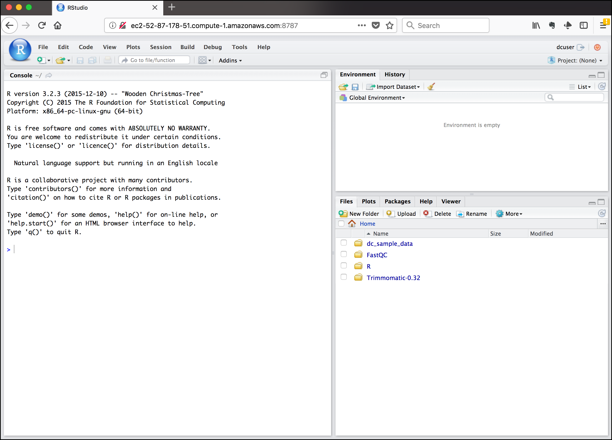
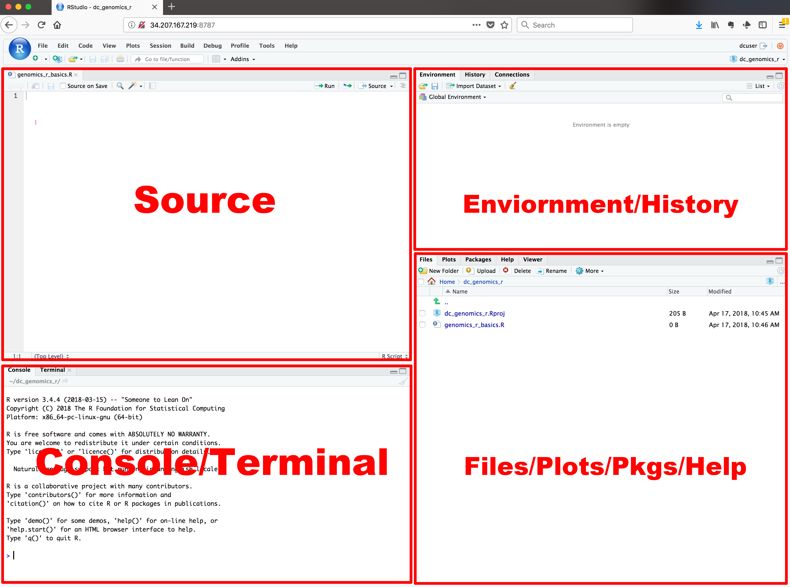

## Getting ready to use R for the first time
In this lesson we will take you through the very first things you need to get
R working, and conclude by showing you the most effective ways to get help
when you are working with R on your own.

>## Tip: This lesson works best on the cloud
> Remember, these lessons assume we are using the pre-configured virtual machine
> instances provided to you at a genomics workshop. Much of this work could be
> done on your laptop, but we use instances to simplify workshop setup
> requirements, and to get you familiar with using the cloud (a common
> requirement for working with big data).
> Visit the [Genomics Workshop setup page](http://www.datacarpentry.org/genomics-workshop/setup/)
> for details on getting this instance running on your own, or for the info you
> need to do this on your own computer.
 {: .callout}

## A Brief History of R
[R](https://en.wikipedia.org/wiki/R_(programming_language)) has been around
since 1995, and was created by Ross Ihaka and Robert Gentleman at the University
of Auckland, New Zealand. R is based off the S programming language developed
at Bell Labs and was developed to teach intro statistics. See this [slide deck](https://www.stat.auckland.ac.nz/~ihaka/downloads/Massey.pdf)
by Ross Ihaka for more info on the subject.

## Advantages of using R
At more than 20 years old, R is fairly mature and [growing in popularity](https://www.tiobe.com/tiobe-index/r/). However, programming isn’t a popularity contest. Here are key advantages of
analyzing data in R:

 - **R is [open source](https://en.wikipedia.org/wiki/Open-source_software)**. Of
   course this means R is free - which is an advantage if you end up at a
   institution where you would have to pay for your own MATLAB or SAS license.
   Open source, is important to your colleagues in parts of the world where
   expensive software in inaccessible. It also means that R is actively
   developed by a community (See [r-project.org](https://www.r-project.org/)),
   and there are regular updates.
 - **R is widely used**. Ok, maybe programming is a popularity contest. Because,
   R is used in many areas (not just bioinformatics), you are more likely to
   find help online when you need it. Chances are, almost any error message you
   run into, someone else has already experienced.
- **R is powerful**. R runs on multiple platforms (Windows/MacOS/Linux). It can
  work with much larger datasets than popular spreadsheet programs like
  Microsoft Excel, and because of its scripting capabilities is far more
  reproducible. Also, there are thousands of available software packages for
  science, including genomics and other areas of life science.

>## Discussion: Your experience
> What has motivated you to learn R? Have you had a research question for which
> spreadsheet programs such as Excel have proven difficult to use, or where the
> size of the data set created issues?
{: .discussion}

----

## Introducing RStudio Server
In these lessons, we will be making use of a software called [RStudio](https://www.rstudio.com/products/RStudio/),
an [Integrated Development Environment (IDE)](https://en.wikipedia.org/wiki/Integrated_development_environment).
RStudio, like most IDEs, provides a graphical interface to R, making it more
user-friendly, and providing dozens of useful features. We will introduce
additional benefits of using RStudio as you cover the lessons. In this case,
we are specifically using [RStudio Server](https://www.rstudio.com/products/RStudio/#Server),
a version of RStudio that can be accessed in your web browser. RStudio Server
has the same features of the Desktop version of RStudio you could download as
standalone software.

## Log on to RStudio Server

Open a web browser and enter the IP address of your instance, followed by
`:8787`. For example, if your IP address was 123.456.789 your URL would be
> ~~~
> http://123.456.789:8787
>
> # Tip: Make sure there are no spaces before or after your URL or your web browser may interpret it as a search query
> ~~~
>
{: .source}

Enter your user credentials and click <kbd>Sign In</kbd>. The credentials for
the genomics Data Carpentry instances are:

 > **username**: dcuser
 >
 > **password**: data4Carp

You should now see the RStudio interface:

---

## Create an RStudio project

One of the first benefits we will take advantage of in RStudio is something
called an **RStudio Project**. An RStudio Project allows you easily save data,
files, variables, packages, etc. related to a specific analysis project you are
conducting in R. Saving your work into a project makes it easy to restart work
where you left off, and also makes it easier to collaborate, especially if you
are using version control such as [git](http://swcarpentry.github.io/git-novice/).

To create a project, go to the <kbd>File</kbd> menu, and click <kbd>New Project...</kbd>.

In the window that opens select **New Directory**, then **Empty Project**. For
"Directory name:" enter **dc_genomics_r**. For "Create project as subdirectory of",
you may leave the default, which is your home directory "~". Finally click
<kbd>Create Project</kbd>. In the "Files" tab of your output pane (more about
the RStudio layout in a moment), you should see an RStudio project file,
**dc_genomics_r.Rroj**. All RStudio projects end with the "**.Rproj**" file
extension.

>## Tip: Make your project more reproducible with Packrat
> One of the most wonderful and also frustrating aspects of working with R is
> managing packages. We will talk more about them, but packages (e.g. ggplot2)
> are add-ons that extend what you can do with R. Unfortunately it is very
> common that you may run into versions of R and/or R packages that are not
> compatible. This may make it difficult for someone to run your R script using
> their version of R or a given R package, and/or make it more difficult to run
> their scripts on your machine. [Packrat](https://rstudio.github.io/packrat/)
> is an RStudio add-on that will associate your packages and project so that
> your work is more portable and reproducible. To turn on Packrat click on
> the <KBD>Tools</KBD> menu and select <KBD>Project Options</KBD>. Under
> **Packrat** check off "**Use packrat with this project**" and follow any
> installation instructions.
{: .callout}

---

## Creating your first R script

Now that we are ready to start exploring R, we will want to keep a record of the
commands we are using. To do this we can create an R script:

Click the <kbd>File</kbd> menu and select <kbd>New File</kbd> and then
<kbd>R Script</kbd>. Before we go any further, save your script by clicking the
save/disk icon that is in the bar above the first line in the script editor, or
click the <kbd>File</kbd> menu and select <kbd>save</kbd>. In the "Save File"
window that opens, name your file **"genomics_r_basics"**. The new script
**genomics_r_basics.R** should appear under "files" in the output pane. By
convention, R scripts end with the file extension **.R**.

---

## Overview and customization of the RStudio layout

Now that we have covered the basics, lets address some ways to configure the
layout of RStudio. First, here are the major windows or panes of the RStudio
environment:

- **Source**: This pane is where you will write/view R scripts. Some outputs
  (such as if you view a dataset using `View()`) will appear as a tab here.
- **Console**: This is actually where you see the execution of commands, and
   what R looks like if you were to run it at the command line without RStudio.
   You can work interactively (i.e. enter R commands here), but for the most
   part, we will run a script, or lines in a script and watch their execution
   and output here.
- **Environment**: Here, RStudio will show you what datasets and variables you
  have created, and which are actively defined/in memory. You can also see some
  characteristics of variables/datasets such as their type and dimensions.
  A history tab also contains a history of executed R commands.
- **Files/plots/help**: This multipurpose pane will show you the contents of
  directories on your computer. You can also use the "Files" tab to navigate and
  set the working directory. The "Plots" tab will show the output of any plots
  generated. In "Packages" you will see what packages are actively loaded, or
  you can attach installed packages. "Help" will display help files for R
  functions/packages.

>## Tip: Downloads from the cloud
> In the "Files" tab you can select a file and download it from your cloud
> instance to your local computer. Uploads are also possible.
{: .callout}

All of the panes in RStudio have configuration options. For example, you can
minimize/maximize a pane, or by moving your mouse in the space between
panes you can resize as needed. The most important customization options for
pane layout are in the <KBD>View</KBD> menu. Other options such as font sizes,
colors/themes, and more are in the <KBD>Tools</KBD> menu under
<KBD>Global Options</KBD>.

>## Don't be fooled - you are working with R
> Although we won't be working with R at the terminal, there are lots of reasons
> to. For example, once you have written an RScript, you can run it at any Linux
> or Windows terminal without the need to start up RStudio. We just don't want
> you to get confused - RStudio runs R, but R is not RStudio. For more on
> running an R Script at the terminal see this [Carpentry lesson](https://swcarpentry.github.io/r-novice-inflammation/05-cmdline/).
{: .callout}

---

## Getting to work with R: navigating directories
Now that we have covered the more aesthetic aspects of RStudio, we can get to
work learning some commands. We will write, execute, and save the commands we
learn in our **genomics_r_basics.R** script that is loaded in the Source pane.
First, lets see what directory we are in. To do so, type the following command
into the script:

> ~~~
> getwd()
> ~~~
{: .language-r}

To execute this command, make sure your cursor is on the same line the command
is written. Then click the <KBD>Run</KBD> button that is just above the first
line of your script in the header of the Source pane.

In the console, we expect to see the following output*:

> ~~~
> [1] "/home/dcuser/dc_genomics_r"
> ~~~
{: .output}

\* Notice, at the Console, you will also see the instruction you executed
above the output in blue.

Since we will be learning several commands, we may already want to keep some
short notes in our script to explain the purpose of the command. Entering a `#`
before any line in an R script. Edit your script to include a comment on the
purpose of commands you are learning, e.g.:

> ~~~
> # this command shows the current working directory
> getwd()
> ~~~
{: .language-r}

---

> ## Exercise: Work interactively in R
> What happens when you try to enter the `getwd()` command in the Console pane?
>
>> ## solution
>> You will get the same output you did as when you ran `getwd()` from the
>> source. You can run any command in the Console, however, executing it from
>> the source script will make it easier for us to record what we have done,
>> and ultimately run an entire script, instead of entering commands one-by-one.
> {: .solution}
{: .challenge}
---

For the purposes of this exercise we want you to be in the directory `"/home/dcuser/dc_genomics_r"`.
What if you weren't? You can set your home directory using the `setwd()`
command. Enter this command in your script, but *don't run* this yet.

> ~~~
> # This sets the working directory
> setwd()
> ~~~
{: .language-r}

You may have guessed, you need to tell the `setwd()` command
what directory you want to set as your working directory. To do so, inside of
the parentheses, open a set of quotes. Inside the quotes enter a `/` which is
the root directory for Linux. Next, use the <KBD>Tab</KBD> key, to take
advantage of RStudio's Tab-autocompletion method, to select `home`, `dcuser`,
and `dc_genomics_r` directory. The path in your script should look like this:

> ~~~
> # This sets the working directory
> setwd("/home/dcuser/dc_genomics_r")
> ~~~
{: .language-r}

When you run this command, the console repeats the command, but gives you no
output. Instead, you see the blank R prompt: `>`. Congratulations! Although it
seems small, knowing what your working directory is, and being able to set your
working directory is the first step to analyzing your data.

>## Tip: Never use `setwd()`
> Wait, what was the last 2 minutes about? Well, setting your working directory
> is something you need to do, you need to be very careful about using this as
> a step in your script. For example, the top-level path in a Unix file system
> is root `/`, but on Windows it is likely `C:\`. This is one of several ways
> you might cause a script to break because a file path is configured differently
> than your script anticipates. R packages like [`here`](https://cran.r-project.org/web/packages/here/index.html)
> and [`file.path`](https://www.rdocumentation.org/packages/base/versions/3.4.3/topics/file.path)
> allow you to specify file paths is a way that is more operating system
> independent. See Jenny Bryan's [blog post](https://www.tidyverse.org/articles/2017/12/workflow-vs-script/) for this
> and other R tips.
{: .callout}

---

## Using functions in R, without needing to master them
Functions may seem like an advanced topic (and they are), but you have already
been using functions in R. In fact, even if you never learn how anything else
works in R, the next sections will help you understand what is happening in
any R script. A function in R (or any computing language) is basically a short
program that takes an input and returns and output.

> ## Exercise: What do these functions do?
> Try the following functions by writing them in your script. See if you can
> guess what they do, and make sure to add comments to your script about your
> assumed purpose.
> - `dir()`
> - `sessionInfo()`
> - `date()`
> - `Sys.time()`
>
>> ## solution
>> - `dir()` # lists files in the working directory
>> - `sessionInfo()` # Gives the version of R and additional info including
>>    on attached packages
>> - `date()` # Gives the current date
>> - `Sys.time()` # Gives the current time
> {: .solution}
{: .challenge}

You have hopefully noticed a pattern, some more abstract exceptions aside, in R
a function has three key properties:
- functions have a name (e.g. `dir`, `getwd`); note that these are case sensitive!
- following the name, functions have a pair of `()`
- Inside the parentheses, a function may take 0 or more arguments

An argument may be a specific input for your function and/or may modify the
function's behavior. For example the function `round()` will round a number
with a decimal:

> ~~~
> # This will round up a number
> round(3.14)
> ~~~
{: .language-r}

Which returns

> ~~~
> [1] 3
> ~~~
{: .output}

## Getting help with function arguments

Of course, you may have wanted to round to one significant digit. `round()` can
do this, but you may fist need to read the help to find out how. To see the help
(In R sometimes also called a "vignette") enter a `?` in front of the function
name:

> ~~~
> ?round()
> ~~~
{: .language-r}

The "Help" tab will show you information (and often, too much information). You
will slowly learn how to read through all of that. Checking the "Usage" or
"Examples" headings is often a good place to look first. If you look under
"Arguments" we also see what arguments we can "pass" to this function to modify
its behavior. You can also see a function's argument using the `args()` function:

> ~~~
> args(round)
> ~~~
{: .language-r}

Which returns

> ~~~
> function (x, digits = 0)
> NULL
> ~~~
{: .output}

We see that `round()` takes two arguments, `x` which is your number, and a
`digits` argument. The `=` sign indicates that a default (in this case 0) is
already set. Since `x` is not set, `round()` requires we provide it, in contrast
to `digits` where R will use the default value 0 unless you explicitly provide
a different value. We can explicitly set the digits parameter when we call the
function:

> ~~~
> round(3.14159, digits = 2)
> ~~~
{: .language-r}

> ~~~
> [1] 3.14
> ~~~
{: .output}

Or, R accepts what we call "positional arguments", if you pass a function
arguments separated by commas, R assumes that they are in the order you saw
when we used `args()`. In the case below that means that `x` is 3.14159 and
digits is 2.

> ~~~
> round(3.14159, 2)
> ~~~
{: .language-r}

> ~~~
> [1] 3.14
> ~~~
{: .output}

Finally, what if you are using `?` to get help for a function in a package not
installed on your system?

> ~~~
> ?geom_point()
> ~~~
{: .language-r}

will return an error:

> ~~~
> Error in .helpForCall(topicExpr, parent.frame()) :
>   no methods for ‘geom_point’ and no documentation for it as a function
> ~~~
{: .error}

Use two question marks (i.e. `?? geom_point()`) and R will return online search
results in the "Help" tab. Finally, if you think there should be a function,
for example a statistical test, but you aren't sure what R calls it, or what
functions may be available, use the `help.search()` function.

> ## Exercise: Searching for R functions
> Use `help.search()` to find R functions for the following statistical
> functions. Remember to put what you are using for your search query in
> quotes inside the function parentheses.
>
> - Chi-Squared test
> - Student-t test
> - mixed linear model
>
>> ## solution
>>   While your search results may return several tests, we list a few you might
>>   find:
>> - Chi-Squared test: `stats::Chisquare`
>> - Student-t test: `stats::TDist`
>> - mixed linear model: `stats::lm.glm`
> {: .solution}
{: .challenge}

We will discuss more on where to look for the libraries and packages that
contain functions you want to use. For now, be aware that two important ones
are [CRAN](https://cran.r-project.org/) - the main repository for R, and
[Bioconductor](http://bioconductor.org/) - a popular repository for
bioinformatics R.

---

## RStudio contextual help

Here is one last bonus we will mention about RStudio. It's difficult to
remember all of the arguments and definitions associated with a given function.
When you start typing the name of a function and hit the <KBD>Tab</KBD> key,
RStudio will display functions and associated help:

Once you type a function, hitting the <KBD>Tab</KBD> inside the parentheses
will remind you of arguments and provide additional help.

---

## Getting help with R

Finally, no matter how much experience you have with R, you will find yourself
needing help. There is no shame in researching how to do something in R, and
most people will find themselves looking up how to do the same things that
they "should know how to do" over and over again. Here are some tips to make
this process as helpful and efficient as possible.

> "Never memorize something that you can look up"
> - A. Einstein

## Finding help on Stackoverflow and Biostars

Two popular websites will be of great help with many R problems. For **general**
**R questions**, [Stack Overflow](https://stackoverflow.com/) is probably the most
popular online community for developers. If you start your question "How to do X
in R" results from Stack Overflow are usually near the top of the list. For
**bioinformatics specific questions**, [Biostars](https://www.biostars.org/) is
a popular online forum.

>## Tip: Asking for help using online forums:
>
> - When searching for R help, look for answers with the [r](https://stackoverflow.com/questions/tagged/r) tag.
> - Get an account; not required to view answers but to required to post
> - Put in effort to check thoroughly before you post a question; folks get
>   annoyed if you ask a very common question that has been answered multiple
>   times
> - Be careful. While forums are very helpful, you can't know for sure if the
>   advice you are getting is correct
> - See the [How to ask for R help](http://blog.revolutionanalytics.com/2014/01/how-to-ask-for-r-help.html)
>   blog post for more useful tips
>
{: .callout}

## Help people help you

Often, in order to duplicate the issue you are having, someone may need to see
the data you are working with or verify the versions of R or R packages you
are using. The following R functions will help with this:

You can **check the version of R** you are working with using the `sessionInfo()`
function. Actually, it is good to save this information as part of your notes
on any analysis you are doing. When you run the same script that has worked fine
a dozen times before, looking back at these notes will remind you that you
upgraded R and forget to check your script.

> ~~~
> sessionInfo()
> ~~~
{: .language-r}

> ~~~
> R version 3.2.3 (2015-12-10)
> Platform: x86_64-pc-linux-gnu (64-bit)
> Running under: Ubuntu 14.04.3 LTS
>
> locale:
> [1] LC_CTYPE=en_US.UTF-8       LC_NUMERIC=C               LC_TIME=en_US.UTF-8
> [4] LC_COLLATE=en_US.UTF-8     LC_MONETARY=en_US.UTF-8    LC_MESSAGES=en_US.UTF-8
> [7] LC_PAPER=en_US.UTF-8       LC_NAME=C                  LC_ADDRESS=C
> [10] LC_TELEPHONE=C             LC_MEASUREMENT=en_US.UTF-8 LC_IDENTIFICATION=C
>
> attached base packages:
> [1] stats     graphics  grDevices utils     datasets  methods   base
>
> loaded via a namespace (and not attached):
> [1] tools_3.2.3     packrat_0.4.9-1
> ~~~
{: .output}

Many times, there may be some issues with your data and the way it is formatted.
In that case, you may want to share that data with someone else. However, you
may not need to share the whole dataset; looking at a subset of your 50,000 row,
10,000 column dataframe may be TMI (too much information)! You can take an
object you have in memory such as dataframe (if you don't know what this means
yet, we will get to it!) and save it to a file. In our example we will use the
`dput()` function on the `iris` dataframe which is an example dataset that is
installed in R:

> ~~~
> dput(head(iris)) # iris is an example data.frame that comes with R
>                  # the `head()` function just takes the first 6 lines of the iris dataset
> ~~~
{: .language-r}

This generates some output (below) which you will be better able to interpret
after covering the other R lessons. This info would be helpful in understanding
how the data is formatted and possibly revealing problematic issues.

> ~~~
> structure(list(Sepal.Length = c(5.1, 4.9, 4.7, 4.6, 5, 5.4),
>     Sepal.Width = c(3.5, 3, 3.2, 3.1, 3.6, 3.9), Petal.Length = c(1.4,
>     1.4, 1.3, 1.5, 1.4, 1.7), Petal.Width = c(0.2, 0.2, 0.2,
>     0.2, 0.2, 0.4), Species = structure(c(1L, 1L, 1L, 1L, 1L,
>     1L), .Label = c("setosa", "versicolor", "virginica"), class = "factor")), .Names = c("Sepal.Length",
> "Sepal.Width", "Petal.Length", "Petal.Width", "Species"), row.names = c(NA,
> 6L), class = "data.frame")
> ~~~
{: .output}

Alternatively, you can also save objects in R memory to a file by specifying
the name of the object, in this case the `iris` data frame, and passing a
filename to the `file=` argument.

> ~~~
> saveRDS(iris, file="iris.rds") # By convention, we use the .rds file extension
> ~~~
{: .language-r}

---

## Final FAQs on R

Finally, here are a few pieces of introductory R knowledge that are too good to
pass up. While we won't return to them in this course, we put them here because
they come up commonly:

**Do I need to click Run every time I want to run a script?**

- No. In fact, the most common shortcut key allows you to run a command (or
  any lines of the script that are highlighted):
  - Windows execution shortcut: <KBD>Ctrl</KBD>+<KBD>Enter</KBD>
  - Mac execution shortcut: <KBD>Cmd(⌘)</KBD>+<KBD>Enter</KBD>

  To see a complete list of shortcuts, click on the <KBD>Tools</KBD> menu and
  select <KBD>Keyboard Shortcuts Help</KBD>

**What's with the brackets in R console output?**
- R returns an index with your result. When your result contains multiple values,
  the number tells you what ordinal number begins the line, for example:

> ~~~
> 1:101 # generates the sequence of numbers from 1 to 101
> ~~~
{: .language-r}

In the output below, `[81]` indicates that the first value on that line is the
81st item in your result

> ~~~
>   [1]   1   2   3   4   5   6   7   8   9  10  11  12  13  14  15  16  17  18  19  20
>  [21]  21  22  23  24  25  26  27  28  29  30  31  32  33  34  35  36  37  38  39  40
>  [41]  41  42  43  44  45  46  47  48  49  50  51  52  53  54  55  56  57  58  59  60
>  [61]  61  62  63  64  65  66  67  68  69  70  71  72  73  74  75  76  77  78  79  80
>  [81]  81  82  83  84  85  86  87  88  89  90  91  92  93  94  95  96  97  98  99 100
> [101] 101
> ~~~
{: .output}

**Can I run my R script without RStudio?**

- Yes, remember - RStudio is running R. You get to use lots of the enhancements
  RStudio provides, but R works independent of RStudio. See [these tips](https://support.rstudio.com/hc/en-us/articles/218012917-How-to-run-R-scripts-from-the-command-line)
  for running your commands at the command line

**Where else can I learn about RStudio?**
- Check out the <KBD>Help</KBD> menu, especially "Cheatsheets" section

---
