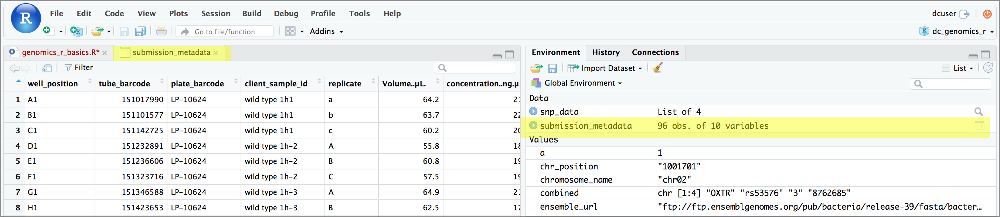
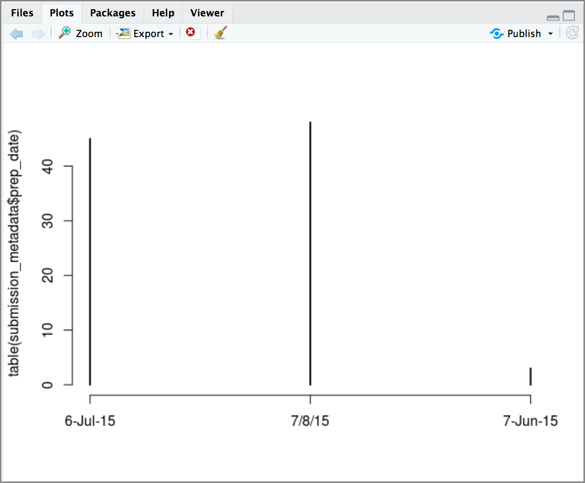

## Working with spreadsheets (tabular data)
A substantial amount of the data we work with in genomics will be tabular data,
this is data arranged in rows and columns - also known as spreadsheets. We could
write a whole lesson on how to work with spreadsheets effectively ([actually we did](http://www.datacarpentry.org/spreadsheet-ecology-lesson/)). For our
purposes, we want to remind you of a few principles before we work with our
first set of example data:

**1) Keep raw data separate from analyzed data**

This is principle number one because if you can't tell which files are the
original raw data, you risk making some serious mistakes (e.g. drawing conculsion
from data which have been manipulated in some unknown way).

**2) Keep speadsheet data Tidy**

The simplest principle of **Tidy data** is that we have one row in our
spreadsheet for each observation or sample, and one colum for every variable
that we measure or report on. As simple as this sounds, it's very easily
violated. Most data scintists agree that significant amounts of their time is
spent tidying data for analysis. Read more about data organization in
[our lesson](http://www.datacarpentry.org/spreadsheet-ecology-lesson/) and
in [this paper](https://www.jstatsoft.org/article/view/v059i10).

**3) Trust but verify**

Finally, while you don't need to be paranoid about data, you should have a plan
for how you will prepare it for analysis. **This a the focus of this lesson.**
You probably already have a lot of intuition, expectations, assumptions about
your data - the range of values you expect, how many values should have
been recorded, etc. Of course, as the data get larger our human ability to
keep track will start to fail (and yes, it can fail for small data sets too).
R will help you to examine your data so that you can have greater confidence
in your analysis, and its reproducibility.

## Importing tabular data into R
There are several ways to import data into R. For our purpose here, we will
focus on using the tools every R installtion comes with (so called "base" R) to
import a comma-delimited file, a sequencing sample submission sheet. We will

First, we need to load the sheet using a function called `read.csv()`.

> ## Exercise: Review the arguments of the `read.csv()` function
> **Before using the `read.csv()` function, use R's help feature to answer the
> following questions**.
>
> *Hint*: Entering '?' before the function name and then running that line will
> bring up the help documentation. Also, when reading this particular help
> be careful to pay attention to the 'read.csv' expression under the 'Usage'
> heading. Other answers will be in the 'Arguments' heading.
>
> A) What is the default parameter for 'header' in the `read.csv()` function?
>
> B) What argument would you have to change to read a file that was delimeted
> by semicolons (;) rather than commas?
>
> C) What argument would you have to change to read file in which numbers
> used commas for decimal separation (i.e. 1,00)?
>
> D) What argument would you have to change to read in only the first 10,000 rows
> of a very large file?
>
>> ## solution
>>
>> A) The `read.csv()` function has the argument 'header' set to TRUE by deault,
>> this means the function always assumes the first row is header information,
>> (i.e. column names)
>>
>> B) The `read.csv()` function has the argument 'sep' set to ",". This means
>> the function assumes commas are used as delimiters, as you would expect.
>> Changing this parameter (e.g. `sep=";"`) would now interprit semicolons as
>> delimiters.
>>
>> C) Although it is not listed in the `read.csv()` usage, `read.csv()` is
>> a "version" of the function `read.table()` and accepts all its arguments.
>> If you set `dec=","` you could change the decimal operator. We'd probably
>> assume the delimiter is some other character.
>>
>> D) You can set `nrow` to a numeric value (e.g. `nrow=10000`) to choose how
>> many rows of a file you read in. This may be useful for very large files
>> where not all the data is needed to test some data cleaning steps you are
>> applying.
>>
>> Hopefully, this exercise gets you thinking about using the provided help
>> documentation in R. There are many arguments that exist, but which we wont
>> have time to cover. Look here to get familiar with functions you use
>> frequently, you may be surpized at what you find they can do.
> {: .solution}
{: .challenge}

Now, let's read in the file `sample_submission.csv` which will be located in
`/home/dcuser/dc_sample_data/R`. Save the file as `submission_metadata`. The
first argument to pass to our `read.csv()` function is the file path for our
data. The file path must be in quotes and now is a good time to remember to
use tab autocompletion. **If you use tab autocompletion you avoid typos and
errors in file paths.** Use it!

> ~~~
>## read in a CSV file and save it as 'submission_metadata'
>
> submission_metadata <- read.csv("/home/dcuser/dc_sample_data/R/sample_submission.csv")
> ~~~
{: .language-r}

One of the first things you should notice is that in the Enviornment window,
you have the `submission_metadata` object, listed as 96 obs. (observations/rows)
of 10 variables (columns). Double-clicking on the name of the object will open
a view of the data in a new tab.

## Summarizing and determining the structure of a data frame.
A **data frame is the standard way in R to store tabular data**. A data fame
could also be thought of as a collect of vectors, all of which have the same
length. Using only two functions, we can learn a lot about out data frame
including some summary statics as well as well as the "structure" of the data
frame. Let's examine what each of these functions can tell us:

> ~~~
>## get summary statistics on a data frame
>
> summary(submission_metadata)
> ~~~
{: .language-r}
> ~~~
> well_position  tube_barcode        plate_barcode    client_sample_id replicate  Volume..µL.
> A1     : 1    Min.   :151017990   LP-10624:96    k255M_1h-2 : 3      a: 1      Min.   :  0.50
> A10    : 1    1st Qu.:152123658                  k255N_1h-1 : 3      A:31      1st Qu.: 57.35
> A11    : 1    Median :153386891                  k255N_1h-10: 3      b: 1      Median : 59.60
> A12    : 1    Mean   :153306679                  k255N_1h-11: 3      B:31      Mean   : 65.15
> A2     : 1    3rd Qu.:154445370                  k255N_1h-12: 3      c: 1      3rd Qu.: 62.50
> A3     : 1    Max.   :155537812                  k255N_1h-13: 3      C:31      Max.   :630.10
> (Other):90                                       (Other)    :78
> concentration..ng.µL.      RIN           prep_date   ship_date
> Min.   : 15.82        Min.   :5.600   6-Jul-15:45   20-Jul:96
> 1st Qu.:183.70        1st Qu.:8.200   7/8/15  :48
> Median :197.27        Median :8.500   7-Jun-15: 3
> Mean   :193.06        Mean   :8.474
> 3rd Qu.:209.97        3rd Qu.:8.900
> Max.   :237.12        Max.   :9.600
> ~~~
{: .output}

Our data frame had 10 variables, so we get 10 feilds that summarize the data.
The `tube_barcode`, `Volume..ul.`, `concentration..ng.ul`, `RIN`, variables are
numerical data and so you get summary statistics on the min and max values for
these columns, as well as mean, median, and interquartile ranges. The other data
(e.g. `replicate`, etc.) are treated as catagorical data (which have special
treatment in R - more on this in a bit). The top 6 different catagories and the
number of times they appear (e.g. the replicate called 'A' appeared 31 times)
are displayed. There was only one value for `ship_date`, "20-Jul" which appeared
96 times.

Before we operate on the data, we also need to know a little more about the
data frame structure to do that we use the `str()` function:

> ~~~
>## get the structure of a data frame
>
> str(submission_metadata)
> ~~~
{: .language-r}
> ~~~
>'data.frame':	96 obs. of  10 variables:
 >$ well_position        : Factor w/ 96 levels "A1","A10","A11",..: 1 13 25 37 49 61 73 85 5 17 ...
>$ tube_barcode         : int  151017990 151101577 151142725 151232891 151236606 151323716 151346588 151423653 151462684 151508377 ...
>$ plate_barcode        : Factor w/ 1 level "LP-10624": 1 1 1 1 1 1 1 1 1 1 ...
>$ client_sample_id     : Factor w/ 34 levels "k255M_1h-2","k255N_1h-1",..: 18 18 18 26 26 26 27 27 27 28 ...
>$ replicate            : Factor w/ 6 levels "a","A","b","B",..: 1 3 5 2 4 6 2 4 6 2 ...
>$ Volume..µL.          : num  64.2 63.7 60.2 55.8 60.8 57.5 64.9 62.5 53.9 62.4 ...
>$ concentration..ng.µL.: num  211 220 208 181 191 ...
>$ RIN                  : num  8.1 9.4 8.9 9 8.1 8.6 8.6 8.8 9.5 8.1 ...
>$ prep_date            : Factor w/ 3 levels "6-Jul-15","7/8/15",..: 1 1 1 1 1 1 1 1 1 1 ...
>$ ship_date            : Factor w/ 1 level "20-Jul": 1 1 1 1 1 1 1 1 1 1 ...
> ~~~
{: .output}

Ok, thats a lot up unpack! Some things to notice.

- the object type `data.frame` is displayed in the first row along with its
  dimensions, in this case 96 observations (rows) and 10 variables (columns)
- Each variable (column) has a name (e.g. `well_position`). This is followed
  by the object mode (e.g. factor, int, num, etc.). Notice that before each
  variable name there is a `$` - this will be important later.

## Introducing Factors

Factors are the final major data structure we will introduce in our R genomics
lessons. Factors can be thought of as vectors which are specialized for
categorical data. Given R's specialization for statistics, this make sense since
categorial and contiuous variables usually have different treatments. Sometimes
you may want to have data treated as a fator, but in other cases, this may be
undersirable.

Since some of the data in our data frame are factors, lets see how factors work
using the `factor()` function to create a factor:

> ~~~
>## create a factor 'days of the week' by passing a vector of characters
>
>days_of_the_week <- factor(c('monday',
>                           'tuesday',
>                           'wednesday',
>                           'thursday',
>                           'friday'))
> ~~~
{: .language-r}

Notice what happens when we run a line with just the name of our factor:

> ~~~
># create a factor 'days of the week' by passing a vector of characters
>
>days_of_the_week
> ~~~
{: .language-r}
> ~~~
> [1] monday    tuesday   wednesday thursday  friday
> Levels: friday monday thursday tuesday wednesday
> ~~~
{: .output}

What we get back are the items in our factor, and also something called "Levels".
**Levels are the different categories contained in a factor**. By default, R
will organize the levels in a factor in alphabetical order.

Lets look at the contents of a factor in a slightly diffrent way using `str()`:
> ~~~
>
> str(days_of_the_week)
> ~~~
{: .language-r}
> ~~~
> Factor w/ 5 levels "friday","monday",..: 2 4 5 3 1
> ~~~
{: .output}

For the sake of efficency, R stores the content of a factor as a vector of
integers, which an integer is assigned to each of the possible levels. Recall
levels are assigned in alphabetical order, so:

|Level|integer|
|-----|-------|
|friday|1|
|monday|2|
|thursday|3|
|tuesday|4|
|wednesday|5|

Notice what happens to the levels if we add some repeated values to our factor:

> ~~~
> # create a factor with repeated values
>
> more_days_of_the_week <- factor(c('monday',
>                                  'tuesday',
>                                  'wednesday',
>                                  'thursday',
>                                  'friday',
>                                  'friday',
>                                  'friday'))
> str(more_days_of_the_week)
> ~~~
{: .language-r}
> ~~~
> Factor w/ 5 levels "friday","monday",..: 2 4 5 3 1 1 1
> ~~~
{: .output}

Going back to our chart above, "friday" is assigned "1" in the factor, and that
integer is listed three times in our factor. This is slightly obscure, but it
provides some clarification to why we get this output.

## Plotting and ordering factors

One of the most common uses for factors will be when you plot categorical
values. For example, suppose we want to know how many samples from our sample
submision were preped on each date? We could generate a plot:

> ~~~
> # create a factor with repeated values
>
> plot(table(submission_metadata$prep_date))
> ~~~
{: .language-r}

Let's quickly brake down this line of code:

First we are pulling a single column of data from the `submission_metadata` data
frame using `$` notation:

> ~~~
> # obtain the values of the 'prep_date' variable from the data frame
>
> submission_metadata$prep_date
> ~~~
{: .language-r}
> ~~~
>[1] 6-Jul-15 6-Jul-15 6-Jul-15 6-Jul-15 6-Jul-15 6-Jul-15 6-Jul-15 6-Jul-15 6-Jul-15 6-Jul-15
>[11] 6-Jul-15 6-Jul-15 6-Jul-15 6-Jul-15 6-Jul-15 6-Jul-15 6-Jul-15 6-Jul-15 7-Jun-15 7-Jun-15
>[21] 7-Jun-15 6-Jul-15 6-Jul-15 6-Jul-15 6-Jul-15 6-Jul-15 6-Jul-15 6-Jul-15 6-Jul-15 6-Jul-15
>[31] 6-Jul-15 6-Jul-15 6-Jul-15 6-Jul-15 6-Jul-15 6-Jul-15 6-Jul-15 6-Jul-15 6-Jul-15 6-Jul-15
>[41] 6-Jul-15 6-Jul-15 6-Jul-15 6-Jul-15 6-Jul-15 6-Jul-15 6-Jul-15 6-Jul-15 7/8/15   7/8/15
>[51] 7/8/15   7/8/15   7/8/15   7/8/15   7/8/15   7/8/15   7/8/15   7/8/15   7/8/15   7/8/15
>[61] 7/8/15   7/8/15   7/8/15   7/8/15   7/8/15   7/8/15   7/8/15   7/8/15   7/8/15   7/8/15
>[71] 7/8/15   7/8/15   7/8/15   7/8/15   7/8/15   7/8/15   7/8/15   7/8/15   7/8/15   7/8/15
>[81] 7/8/15   7/8/15   7/8/15   7/8/15   7/8/15   7/8/15   7/8/15   7/8/15   7/8/15   7/8/15
>[91] 7/8/15   7/8/15   7/8/15   7/8/15   7/8/15   7/8/15
>Levels: 6-Jul-15 7/8/15 7-Jun-15
> ~~~
{: .output}

Then we use the `table()` function to turn this into a table of counts:

> ~~~
> # generate a table from values of the 'prep_date' variable from the data frame
>
> table(submission_metadata$prep_date)
> ~~~
{: .language-r}
> ~~~
>6-Jul-15   7/8/15 7-Jun-15
>      45       48        3
> ~~~
{: .output}

Finally, we use R's `plot()` function which attemtps to generate a plot from the
data:
> ~~~
> # generate a plot from values of the 'prep_date' variable from the data frame
>
> plot(table(submission_metadata$prep_date))
> ~~~
{: .language-r}

While this is a toy example, and there are problems with our prep dates that
need fixing, let's see how you order a factor so that we can fix our plot.
We can take our existing `more_days_of_the_week` factor, and use the `factor()`
function again. This time we will pass it two new arguments: `levels` will be
assigned to a vector that has the days of the week in the order we want them,
and we will set the `ordered` argument to TRUE.

> ~~~
> # order the 'more_days_of_the_week' factor to our desired set of levels
>more_days_of_the_week <- factor(more_days_of_the_week, levels = c("monday",
>                                                                  "tuesday",
>                                                                  "wednesday",
>                                                                  "thursday",
>                                                                  "friday"),
>                                ordered = TRUE)
> ~~~
{: .language-r}

We can now see the new ordering:
> ~~~
> str(more_days_of_the_week)
> ~~~
{: .language-r}
> ~~~
> Ord.factor w/ 5 levels "monday"<"tuesday"<..: 1 2 3 4 5 5 5
> ~~~
{: .output}

Although not all levels are shown, notice there are `<` signs indicating an
order.

> ## Exercise: Order and plot `sample_submission` `prep_date`
>
> **Generate a plot of the `prep_date` variable, properly ordered from the `sample_submission`
> data frame**
>
> To choose the ordering, assume that the unambiguous dates for this data are:
> - 7-Jun-15: June 7, 205
> - 6-Jul-15: July 6, 2015
> - 7/8/15: July 8, 2015
>
> *hint* you can use the `factor()` function inside of your `table()`and `plot()`
> function calls.
>
> *hint* build this single line of code from the inside out!
>> ## solution
>>plot(table(factor(submission_metadata$prep_date, levels = c("7-Jun-15",
>>                                                 "6-Jul-15",
>>                                                 "7/8/15"),
>>       ordered = TRUE)))
>>
>>
>> 
> {: .solution}
{: .challenge}

---
