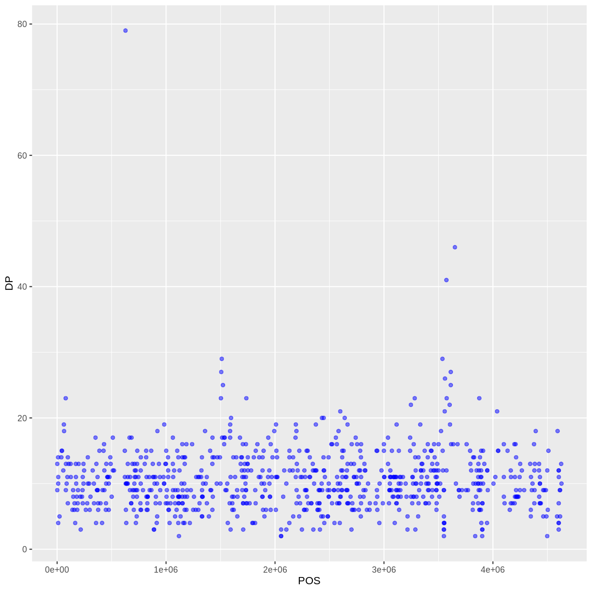
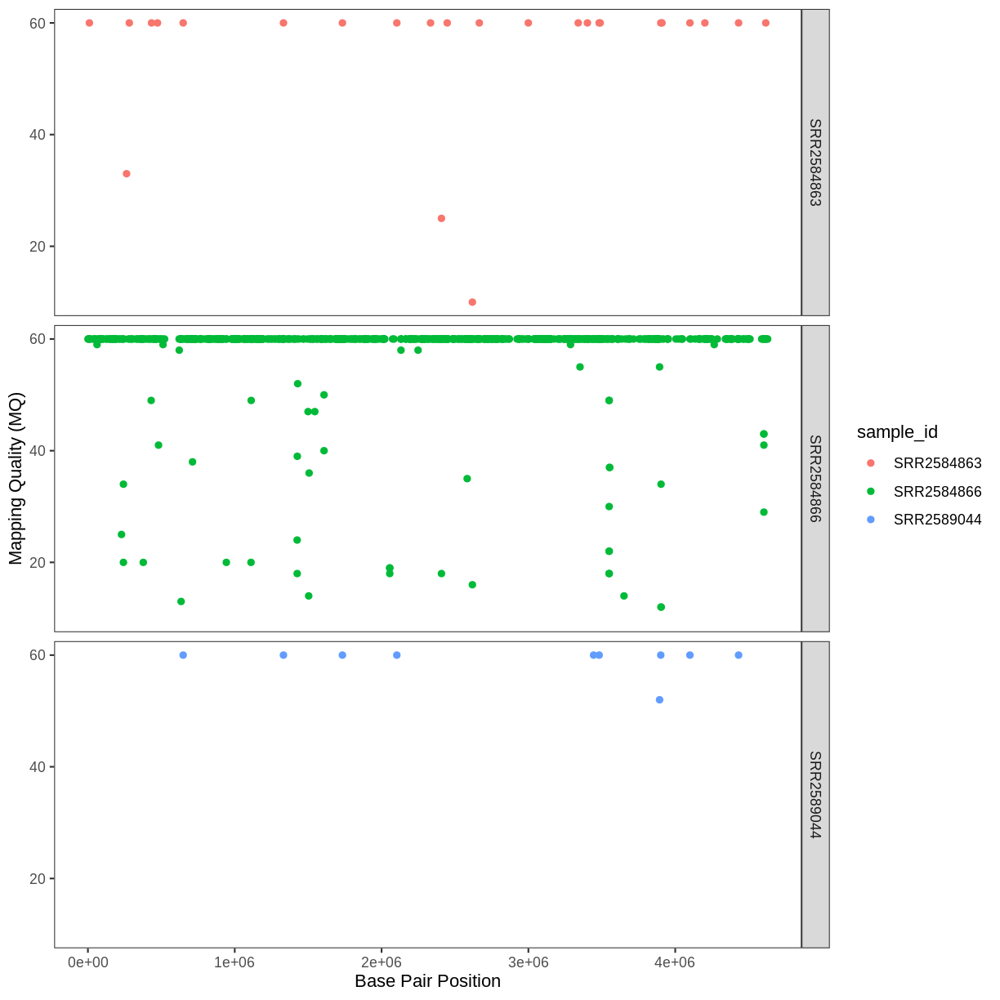
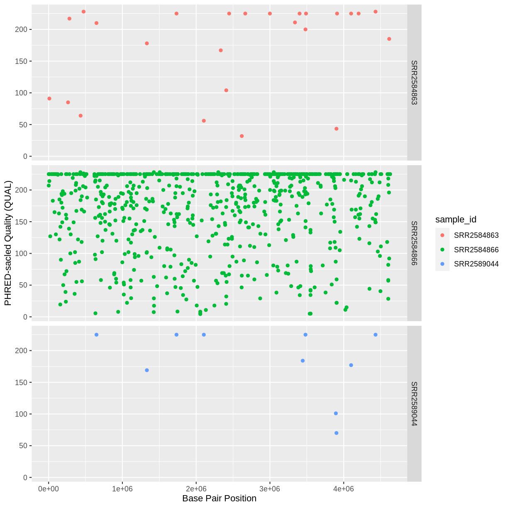
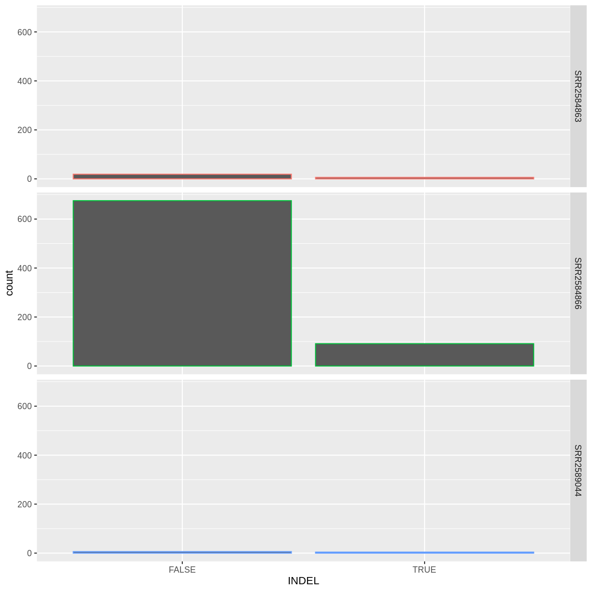

---
# Please do not edit this file directly; it is auto generated.
# Instead, please edit 06-data-visualization.md in _episodes_rmd/
title: "Data Visualization with ggplot2"
teaching: 60
exercises: 30
questions:
- ""
- ""
objectives:
- ""
- "Describe the role of data, aesthetics, and geoms in ggplot functions."
- "Choose the correct aesthetics and alter the geom parameters for a scatter plot, histogram, or box plot."
- "Layer multiple geometries in a single plot."
- "Customize plot scales, titles, subtitles, themes, fonts, layout, and orientation."
- "Apply a facet to a plot."
- "Apply additional ggplot2-compatible plotting libraries."
- "Save a ggplot to a file."
- "List several resources for getting help with ggplot."
- "List several resources for creating informative scientific plots."

keypoints:
- ""
- ""
- ""
source: Rmd
---

We start by loading the package **`ggplot2`**.

~~~
library(ggplot2)
~~~
{: .language-r}
## Plotting with **`ggplot2`**

**`ggplot2`** is a plotting package that makes it simple to create complex plots
from data in a data frame. It provides a more programmatic interface for
specifying what variables to plot, how they are displayed, and general visual
properties. Therefore, we only need minimal changes if the underlying data change
or if we decide to change from a bar plot to a scatter plot. This helps in creating
publication quality plots with minimal amounts of adjustments and tweaking.

**`ggplot2`** functions like data in the 'long' format, i.e., a column for every dimension,
and a row for every observation. Well-structured data will save you lots of time
when making figures with **`ggplot2`**

ggplot graphics are built step by step by adding new elements. Adding layers in
this fashion allows for extensive flexibility and customization of plots.

To build a ggplot, we will use the following basic template that can be used for different types of plots:

~~~
ggplot(data = <DATA>, mapping = aes(<MAPPINGS>)) +  <GEOM_FUNCTION>()
~~~
{: .language-r}

- use the `ggplot()` function and bind the plot to a specific data frame using the
      `data` argument

~~~
ggplot(data = variants)
~~~
{: .language-r}

- define a mapping (using the aesthetic (`aes`) function), by selecting the variables to be plotted and specifying how to present them in the graph, e.g. as x/y positions or characteristics such as size, shape, color, etc.

~~~
ggplot(data = variants, aes(x = POS, y = DP))
~~~
{: .language-r}

- add 'geoms' – graphical representations of the data in the plot (points,
  lines, bars). **`ggplot2`** offers many different geoms; we will use some
  common ones today, including:

      * `geom_point()` for scatter plots, dot plots, etc.
      * `geom_boxplot()` for, well, boxplots!
      * `geom_line()` for trend lines, time series, etc.

To add a geom to the plot use the `+` operator. Because we have two continuous variables,
let's use `geom_point()` first:

~~~
ggplot(data = variants, aes(x = POS, y = DP)) +
  geom_point()
~~~
{: .language-r}

The `+` in the **`ggplot2`** package is particularly useful because it allows you
to modify existing `ggplot` objects. This means you can easily set up plot
templates and conveniently explore different types of plots, so the above
plot can also be generated with code like this:

~~~
# Assign plot to a variable
coverage_plot <- ggplot(data = variants, aes(x = POS, y = DP))

# Draw the plot
coverage_plot +
    geom_point()
~~~
{: .language-r}

**Notes**

- Anything you put in the `ggplot()` function can be seen by any geom layers
  that you add (i.e., these are universal plot settings). This includes the x- and
  y-axis mapping you set up in `aes()`.
- You can also specify mappings for a given geom independently of the
  mappings defined globally in the `ggplot()` function.
- The `+` sign used to add new layers must be placed at the end of the line containing
the *previous* layer. If, instead, the `+` sign is added at the beginning of the line
containing the new layer, **`ggplot2`** will not add the new layer and will return an
error message.

~~~
# This is the correct syntax for adding layers
coverage_plot +
  geom_point()

# This will not add the new layer and will return an error message
coverage_plot
  + geom_point()
~~~
{: .language-r}

## Building your plots iteratively

Building plots with **`ggplot2`** is typically an iterative process. We start by
defining the dataset we'll use, lay out the axes, and choose a geom:

~~~
ggplot(data = variants, aes(x = POS, y = DP)) +
  geom_point()
~~~
{: .language-r}

Then, we start modifying this plot to extract more information from it. For
instance, we can add transparency (`alpha`) to avoid overplotting:

~~~
ggplot(data = variants, aes(x = POS, y = DP)) +
    geom_point(alpha = 0.5)
~~~
{: .language-r}

We can also add colors for all the points:

~~~
ggplot(data = variants, aes(x = POS, y = DP)) +
  geom_point(alpha = 0.5, color = "blue")
~~~
{: .language-r}

Or to color each species in the plot differently, you could use a vector as an input to the argument **color**. **`ggplot2`** will provide a different color corresponding to different values in the vector. Here is an example where we color with **`sample_id`**:

~~~
ggplot(data = variants, aes(x = POS, y = DP, color = sample_id)) +
  geom_point(alpha = 0.5)
~~~
{: .language-r}

Notice that we can change the geom layer and colors will be still determined by **`sample_id`**

~~~
ggplot(data = variants, aes(x = POS, y = DP, color = sample_id)) +
  geom_jitter(alpha = 0.5)
~~~
{: .language-r}

To make our plot more readable, we can add axis labels:

~~~
ggplot(data = variants, aes(x = POS, y = DP, color = sample_id)) +
  geom_jitter(alpha = 0.5) +
  labs(x = "Base Pair Position",
       y = "Read Depth (DP)")
~~~
{: .language-r}

> ## Challenge
>
> Use what you just learned to create a scatter plot of mapping quality (`MQ`) over
> position (`POS`) with the samples showing in different colors. Make sure to give your plot
> relevant axis labels.
>
> > ## Solution
> > 
> > ~~~
> >  ggplot(data = variants, aes(x = POS, y = MQ, color = sample_id)) +
> >   geom_point() +
> >   labs(x = "Base Pair Position",
> >        y = "Mapping Quality (MQ)")
> > ~~~
> > {: .language-r}
> > 
> > 
> {: .solution}
{: .challenge}

## Faceting

**`ggplot2`** has a special technique called *faceting* that allows the user to split one
plot into multiple plots based on a factor included in the dataset. We will use it to split our
mapping quality plot into three panels, one for each sample.

~~~
ggplot(data = variants, aes(x = POS, y = MQ, color = sample_id)) +
 geom_point() +
 labs(x = "Base Pair Position",
      y = "Mapping Quality (MQ)") +
 facet_grid(. ~ sample_id)
~~~
{: .language-r}

This looks ok, but it would be easier to read if the plot facets were stacked vertically rather
than horizontally. The `facet_grid`
geometry allows you to explicitly specify how you want your plots to be
arranged via formula notation (`rows ~ columns`; a `.` can be used as
a placeholder that indicates only one row or column).

~~~
ggplot(data = variants, aes(x = POS, y = MQ, color = sample_id)) +
 geom_point() +
 labs(x = "Base Pair Position",
      y = "Mapping Quality (MQ)") +
 facet_grid(sample_id ~ .)
~~~
{: .language-r}

Usually plots with white background look more readable when printed.  We can set
the background to white using the function `theme_bw()`. Additionally, you can remove
the grid:

~~~
ggplot(data = variants, aes(x = POS, y = MQ, color = sample_id)) +
  geom_point() +
  labs(x = "Base Pair Position",
       y = "Mapping Quality (MQ)") +
  facet_grid(sample_id ~ .) +
  theme_bw() +
  theme(panel.grid = element_blank())
~~~
{: .language-r}

> ## Challenge
>
> Use what you just learned to create a scatter plot of PHRED scaled quality (`QUAL`) over
> position (`POS`) with the samples showing in different colors. Make sure to give your plot
> relevant axis labels.
>
> > ## Solution
> > 
> > ~~~
> >  ggplot(data = variants, aes(x = POS, y = QUAL, color = sample_id)) +
> >   geom_point() +
> >   labs(x = "Base Pair Position",
> >        y = "PHRED-sacled Quality (QUAL)") +
> >   facet_grid(sample_id ~ .)
> > ~~~
> > {: .language-r}
> > 
> > 
> {: .solution}
{: .challenge}

## Barplots

We can create barplots using the `geom_bar` geom. Let's make a barplot showing
the number of variants for each sample that are indels.

~~~
ggplot(data = variants, aes(x = INDEL, fill = sample_id)) +
  geom_bar() +
  facet_grid(sample_id ~ .)
~~~
{: .language-r}

> ## Challenge
> Since we already have the sample_id labels on the individual plot facets, we don't need the
> legend. Use the help file for `geom_bar` and any other online resources you want to use to
> remove the legend from the plot.
>
>> ## Solution
>> 
>> ~~~
>> ggplot(data = variants, aes(x = INDEL, color = sample_id)) +
>>    geom_bar(show.legend = F) +
>>    facet_grid(sample_id ~ .)
>> ~~~
>> {: .language-r}
>> 
>> 
> {: .solution}
{: .challenge}

## **`ggplot2`** themes

In addition to `theme_bw()`, which changes the plot background to white, **`ggplot2`**
comes with several other themes which can be useful to quickly change the look
of your visualization. The complete list of themes is available
at <https://ggplot2.tidyverse.org/reference/ggtheme.html>. `theme_minimal()` and
`theme_light()` are popular, and `theme_void()` can be useful as a starting
point to create a new hand-crafted theme.

The
[ggthemes](https://jrnold.github.io/ggthemes/reference/index.html) package
provides a wide variety of options (including an Excel 2003 theme).
The [**`ggplot2`** extensions website](https://exts.ggplot2.tidyverse.org/) provides a list
of packages that extend the capabilities of **`ggplot2`**, including additional
themes.

> ## Challenge
>
> With all of this information in hand, please take another five minutes to
> either improve one of the plots generated in this exercise or create a
> beautiful graph of your own. Use the RStudio [**`ggplot2`** cheat sheet](https://github.com/rstudio/cheatsheets/raw/master/data-visualization-2.1.pdf)
> for inspiration. Here are some ideas:
>
> * See if you can change the size or shape of the plotting symbol.
> * Can you find a way to change the name of the legend? What about its labels?
> * Try using a different color palette (see
>   http://www.cookbook-r.com/Graphs/Colors_(ggplot2)/).
{: .challenge}
