---
# Please do not edit this file directly; it is auto generated.
# Instead, please edit 06-data-visualization.md in _episodes_rmd/
title: "Data Visualization with ggplot2"
teaching: 60
exercises: 30
objectives:
- Describe the role of data, aesthetics, and geoms in ggplot functions.
- Choose the correct aesthetics and alter the geom parameters for a scatter plot,
  histogram, or box plot.
- Layer multiple geometries in a single plot.
- Customize plot scales, titles, subtitles, themes, fonts, layout, and orientation.
- Apply a facet to a plot.
- Apply additional ggplot2-compatible plotting libraries.
- Save a ggplot to a file.
- List several resources for getting help with ggplot.
- List several resources for creating informative scientific plots.
keypoints:
- ggplot2 is a powerful tool for high-quality plots
- ggplot2 provides a flexiable and readable grammar to build plots
source: Rmd
questions:
- Why ggplot2?
- How to produce publication-quality plots?
---

## Plotting with **`ggplot2`**

**`ggplot2`** is a plotting package that makes it simple to create complex plots from data in a data frame. It provides a more programmatic interface for specifying what variables to plot, how they are displayed, and general visual properties. Therefore, we only need minimal changes if the underlying data change or if we decide to change from a bar plot to a scatter plot. This helps in creating publication quality plots with minimal amounts of adjustments and tweaking.

**`ggplot2`** belongs to the [**`tidyverse`** framework](https://www.tidyverse.org/). Therefore, we will start with loading the package **`tidyverse`**.

if **`tidyverse`** is not already installed, then we need to install first. If it is already installed, then we can skip the following step

~~~
# Installing the tidyverse pacakge, which also include ggplot2
install.packages("tidyverse")
~~~
{: .language-r}

Now, let's load the `tidyverse` package:

~~~
library(tidyverse)
~~~
{: .language-r}

~~~
── Attaching packages ─────────────────────────────────────── tidyverse 1.3.1 ──
~~~
{: .output}

~~~
✔ ggplot2 3.3.6     ✔ purrr   0.3.4
✔ tibble  3.1.7     ✔ dplyr   1.0.9
✔ tidyr   1.2.0     ✔ stringr 1.4.0
✔ readr   2.1.2     ✔ forcats 0.5.1
~~~
{: .output}

~~~
── Conflicts ────────────────────────────────────────── tidyverse_conflicts() ──
✖ dplyr::filter() masks stats::filter()
✖ dplyr::lag()    masks stats::lag()
~~~
{: .output}

As we can see from above output **`ggplot2`** has been already loaded along with other packages as part of the **`tidyverse`** framework.

Loading the dataset

~~~
variants = read_csv("https://raw.githubusercontent.com/naupaka/vcfr-for-data-carpentry-draft/main/output/combined_tidy_vcf.csv")
~~~
{: .language-r}

~~~
Rows: 801 Columns: 29
── Column specification ────────────────────────────────────────────────────────
Delimiter: ","
chr  (7): sample_id, CHROM, REF, ALT, DP4, Indiv, gt_GT_alleles
dbl (16): POS, QUAL, IDV, IMF, DP, VDB, RPB, MQB, BQB, MQSB, SGB, MQ0F, AC, ...
lgl  (5): ID, FILTER, INDEL, ICB, HOB

ℹ Use `spec()` to retrieve the full column specification for this data.
ℹ Specify the column types or set `show_col_types = FALSE` to quiet this message.
~~~
{: .output}

~~~
glimpse(variants)
~~~
{: .language-r}

~~~
Rows: 801
Columns: 29
$ sample_id     <chr> "SRR2584863", "SRR2584863", "SRR2584863", "SRR2584863", …
$ CHROM         <chr> "CP000819.1", "CP000819.1", "CP000819.1", "CP000819.1", …
$ POS           <dbl> 9972, 263235, 281923, 433359, 473901, 648692, 1331794, 1…
$ ID            <lgl> NA, NA, NA, NA, NA, NA, NA, NA, NA, NA, NA, NA, NA, NA, …
$ REF           <chr> "T", "G", "G", "CTTTTTTT", "CCGC", "C", "C", "G", "ACAGC…
$ ALT           <chr> "G", "T", "T", "CTTTTTTTT", "CCGCGC", "T", "A", "A", "AC…
$ QUAL          <dbl> 91.0000, 85.0000, 217.0000, 64.0000, 228.0000, 210.0000,…
$ FILTER        <lgl> NA, NA, NA, NA, NA, NA, NA, NA, NA, NA, NA, NA, NA, NA, …
$ INDEL         <lgl> FALSE, FALSE, FALSE, TRUE, TRUE, FALSE, FALSE, FALSE, TR…
$ IDV           <dbl> NA, NA, NA, 12, 9, NA, NA, NA, 2, 7, NA, NA, NA, NA, NA,…
$ IMF           <dbl> NA, NA, NA, 1.000000, 0.900000, NA, NA, NA, 0.666667, 1.…
$ DP            <dbl> 4, 6, 10, 12, 10, 10, 8, 11, 3, 7, 9, 20, 12, 19, 15, 10…
$ VDB           <dbl> 0.0257451, 0.0961330, 0.7740830, 0.4777040, 0.6595050, 0…
$ RPB           <dbl> NA, 1.000000, NA, NA, NA, NA, NA, NA, NA, NA, 0.900802, …
$ MQB           <dbl> NA, 1.0000000, NA, NA, NA, NA, NA, NA, NA, NA, 0.1501340…
$ BQB           <dbl> NA, 1.000000, NA, NA, NA, NA, NA, NA, NA, NA, 0.750668, …
$ MQSB          <dbl> NA, NA, 0.974597, 1.000000, 0.916482, 0.916482, 0.900802…
$ SGB           <dbl> -0.556411, -0.590765, -0.662043, -0.676189, -0.662043, -…
$ MQ0F          <dbl> 0.000000, 0.166667, 0.000000, 0.000000, 0.000000, 0.0000…
$ ICB           <lgl> NA, NA, NA, NA, NA, NA, NA, NA, NA, NA, NA, NA, NA, NA, …
$ HOB           <lgl> NA, NA, NA, NA, NA, NA, NA, NA, NA, NA, NA, NA, NA, NA, …
$ AC            <dbl> 1, 1, 1, 1, 1, 1, 1, 1, 1, 1, 1, 1, 1, 1, 1, 1, 1, 1, 1,…
$ AN            <dbl> 1, 1, 1, 1, 1, 1, 1, 1, 1, 1, 1, 1, 1, 1, 1, 1, 1, 1, 1,…
$ DP4           <chr> "0,0,0,4", "0,1,0,5", "0,0,4,5", "0,1,3,8", "1,0,2,7", "…
$ MQ            <dbl> 60, 33, 60, 60, 60, 60, 60, 60, 60, 60, 25, 60, 10, 60, …
$ Indiv         <chr> "/home/dcuser/dc_workshop/results/bam/SRR2584863.aligned…
$ gt_PL         <dbl> 1210, 1120, 2470, 910, 2550, 2400, 2080, 2550, 11128, 19…
$ gt_GT         <dbl> 1, 1, 1, 1, 1, 1, 1, 1, 1, 1, 1, 1, 1, 1, 1, 1, 1, 1, 1,…
$ gt_GT_alleles <chr> "G", "T", "T", "CTTTTTTTT", "CCGCGC", "T", "A", "A", "AC…
~~~
{: .output}

**`ggplot2`** functions like data in the **long** format, i.e., a column for every dimension (variable), and a row for every observation. Well-structured data will save you time when making figures with **`ggplot2`**

**`ggplot2`** graphics are built step-by-step by adding new elements. Adding layers in this fashion allows for extensive flexibility and customization of plots, and more equally important the readability of the code.

To build a ggplot, we will use the following basic template that can be used for different types of plots:

~~~
ggplot(data = <DATA>, mapping = aes(<MAPPINGS>)) +  <GEOM_FUNCTION>()
~~~
{: .language-r}

- use the `ggplot()` function and bind the plot to a specific data frame using the
      `data` argument

~~~
ggplot(data = variants)
~~~
{: .language-r}

- define a mapping (using the aesthetic (`aes`) function), by selecting the variables to be plotted and specifying how to present them in the graph, e.g. as x and y positions or characteristics such as size, shape, color, etc.

~~~
ggplot(data = variants, aes(x = POS, y = DP))
~~~
{: .language-r}

- add 'geoms' – graphical representations of the data in the plot (points,
  lines, bars). **`ggplot2`** offers many different geoms; we will use some
  common ones today, including:

      * `geom_point()` for scatter plots, dot plots, etc.
      * `geom_boxplot()` for, well, boxplots!
      * `geom_line()` for trend lines, time series, etc.

To add a geom to the plot use the `+` operator. Because we have two continuous variables, let's use `geom_point()` (i.e., a scatter plot) first:

~~~
ggplot(data = variants, aes(x = POS, y = DP)) +
  geom_point()
~~~
{: .language-r}

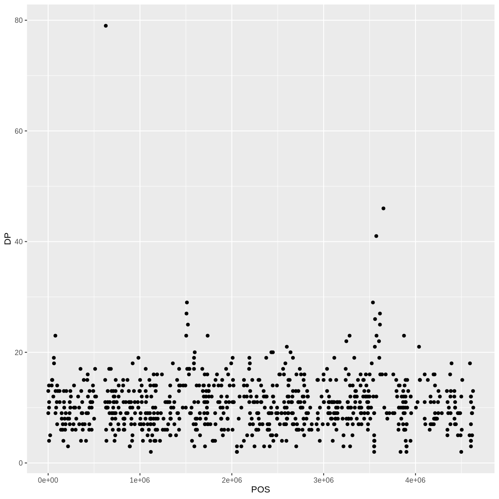

The `+` in the **`ggplot2`** package is particularly useful because it allows you to modify existing `ggplot` objects. This means you can easily set up plot templates and conveniently explore different types of plots, so the above plot can also be generated with code like this:

~~~
# Assign plot to a variable
coverage_plot <- ggplot(data = variants, aes(x = POS, y = DP))

# Draw the plot
coverage_plot +
    geom_point()
~~~
{: .language-r}

**Notes**

- Anything you put in the `ggplot()` function can be seen by any geom layers that you add (i.e., these are universal plot settings). This includes the x- and y-axis mapping you set up in `aes()`.
- You can also specify mappings for a given geom independently of the mappings defined globally in the `ggplot()` function.
- The `+` sign used to add new layers must be placed at the end of the line containing the *previous* layer. If, instead, the `+` sign is added at the beginning of the line containing the new layer, **`ggplot2`** will not add the new layer and will return an error message.

~~~
# This is the correct syntax for adding layers
coverage_plot +
  geom_point()

# This will not add the new layer and will return an error message
coverage_plot
  + geom_point()
~~~
{: .language-r}

## Building your plots iteratively

Building plots with **`ggplot2`** is typically an iterative process. We start by defining the dataset we'll use, lay out the axes, and choose a geom:

~~~
ggplot(data = variants, aes(x = POS, y = DP)) +
  geom_point()
~~~
{: .language-r}

Then, we start modifying this plot to extract more information from it. For instance, we can add transparency (`alpha`) to avoid over-plotting:

~~~
ggplot(data = variants, aes(x = POS, y = DP)) +
    geom_point(alpha = 0.5)
~~~
{: .language-r}

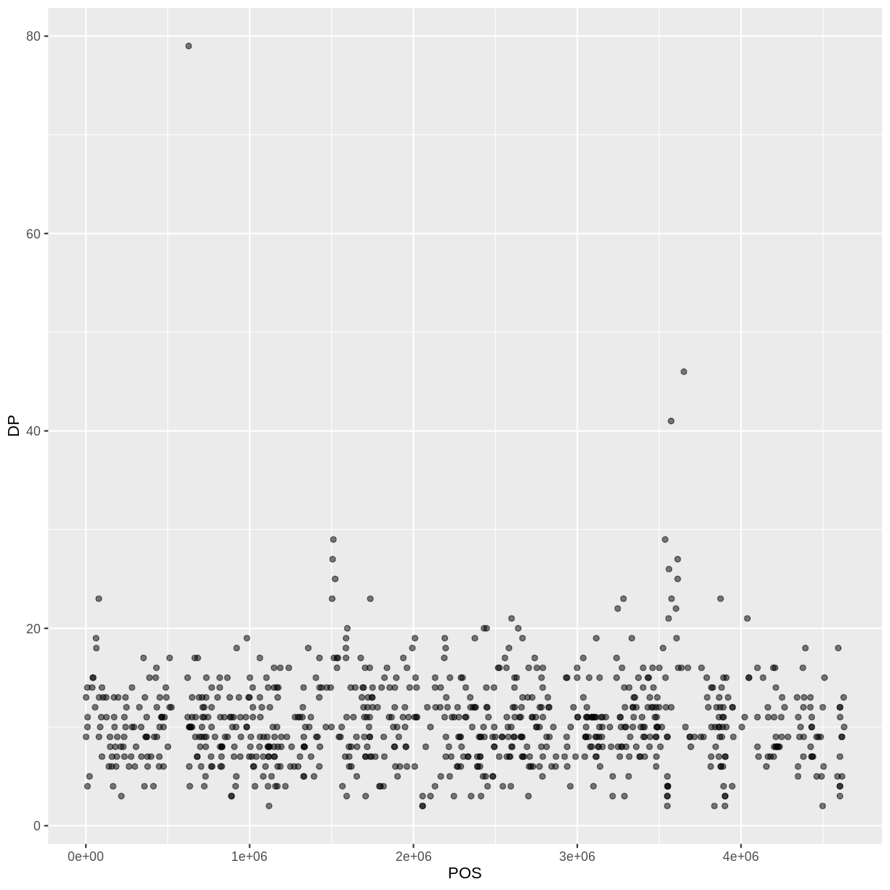

We can also add colors for all the points:

~~~
ggplot(data = variants, aes(x = POS, y = DP)) +
  geom_point(alpha = 0.5, color = "blue")
~~~
{: .language-r}

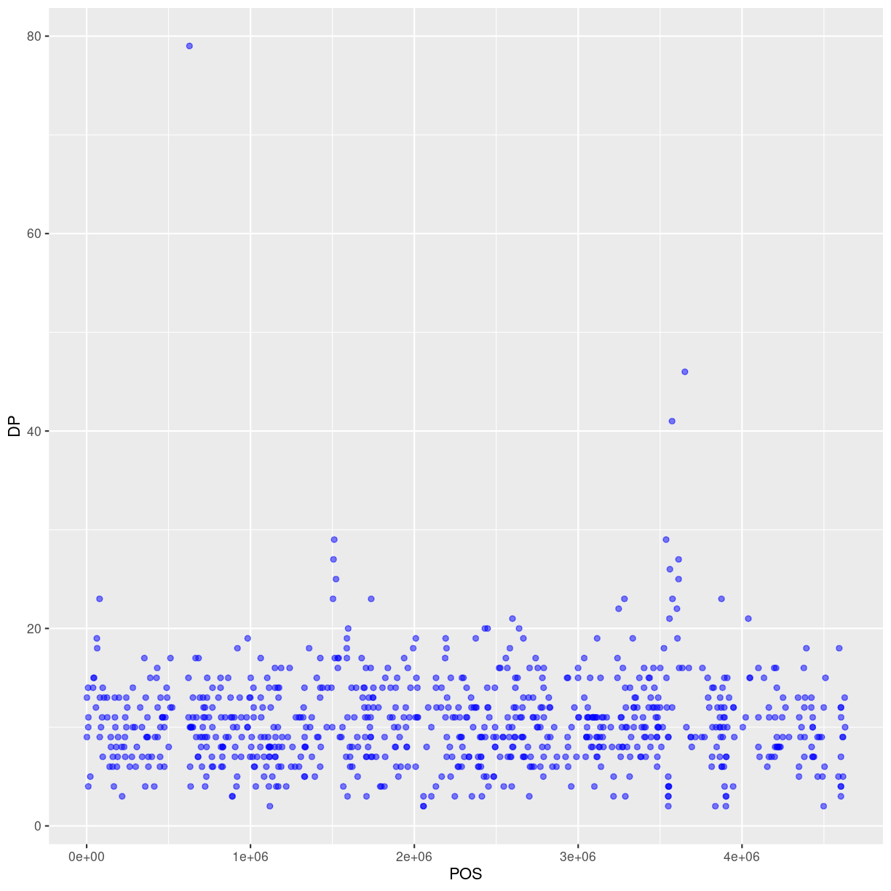

Or to color each species in the plot differently, you could use a vector as an input to the argument **color**. **`ggplot2`** will provide a different color corresponding to different values in the vector. Here is an example where we color with **`sample_id`**:

~~~
ggplot(data = variants, aes(x = POS, y = DP, color = sample_id)) +
  geom_point(alpha = 0.5)
~~~
{: .language-r}

Notice that we can change the geom layer and colors will be still determined by **`sample_id`**

~~~
ggplot(data = variants, aes(x = POS, y = DP, color = sample_id)) +
  geom_jitter(alpha = 0.5)
~~~
{: .language-r}

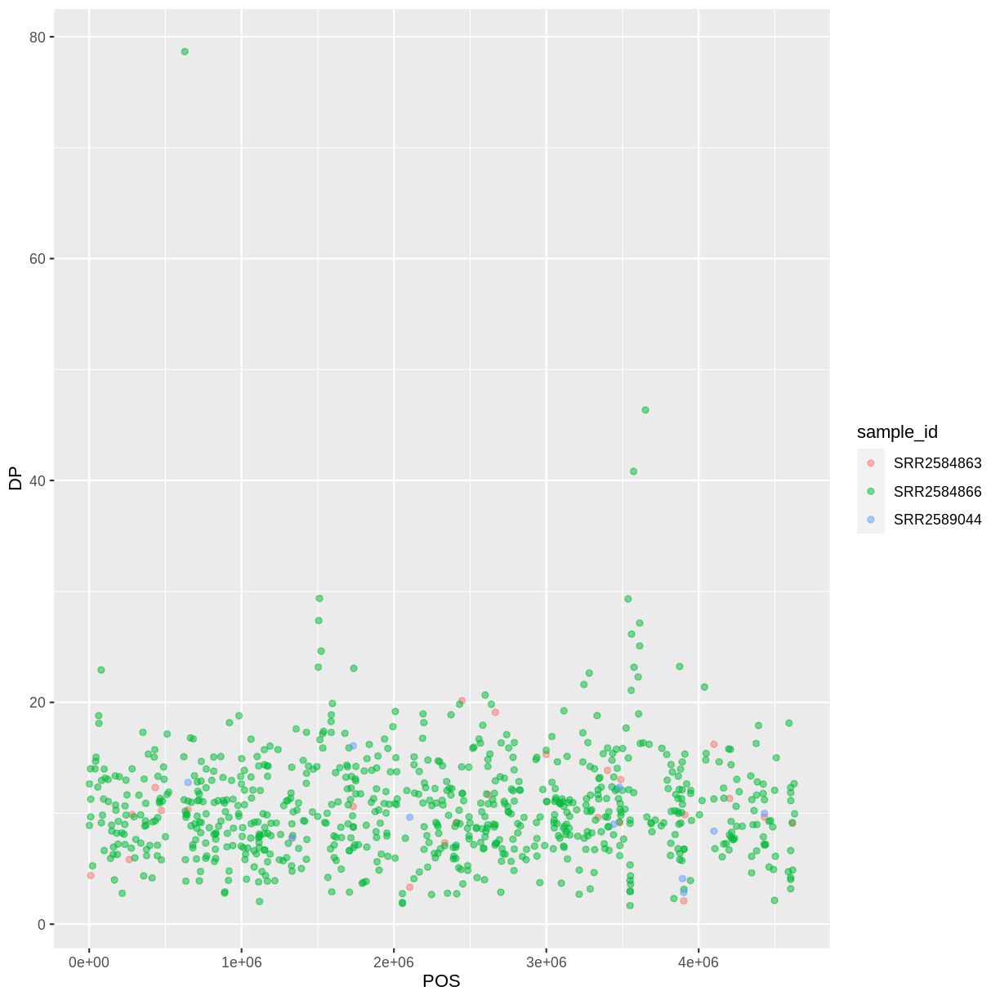

To make our plot more readable, we can add axis labels:

~~~
ggplot(data = variants, aes(x = POS, y = DP, color = sample_id)) +
  geom_jitter(alpha = 0.5) +
  labs(x = "Base Pair Position",
       y = "Read Depth (DP)")
~~~
{: .language-r}

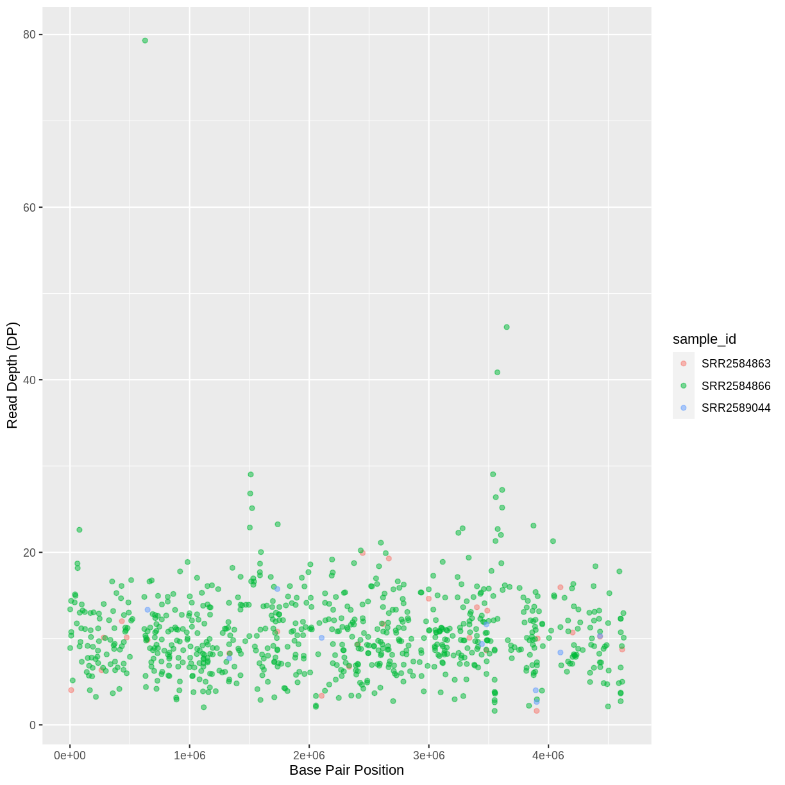

Now the figure is complete and ready to be exported and saved to a file. This can be achieved easily using [`ggsave()`](https://ggplot2.tidyverse.org/reference/ggsave.html), which can write, by default, the most recent generated figure into different formats (e.g., `jpeg`, `png`, `pdf`) according to the file extension. So, for example, to create a pdf version of the above figure with a dimension of $6\times4$ inches:

~~~
ggsave ("depth.pdf", width = 6, height = 4)
~~~
{: .language-r}

If we check the current working directory, there should be a newly created file called `depth.pdf` with the above plot.

> ## Challenge
>
> Use what you just learned to create a scatter plot of mapping quality (`MQ`) over
> position (`POS`) with the samples showing in different colors. Make sure to give your plot
> relevant axis labels.
>
> > ## Solution
> > 
> > ~~~
> >  ggplot(data = variants, aes(x = POS, y = MQ, color = sample_id)) +
> >   geom_point() +
> >   labs(x = "Base Pair Position",
> >        y = "Mapping Quality (MQ)")
> > ~~~
> > {: .language-r}
> > 
> > 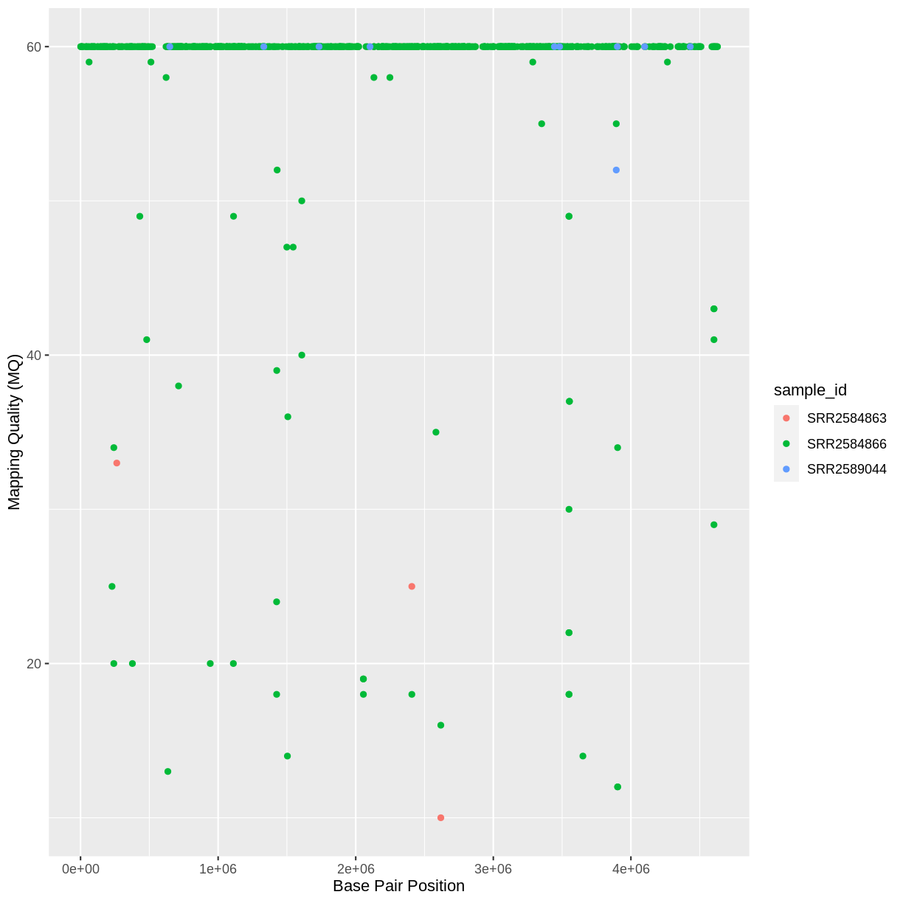
> {: .solution}
{: .challenge}

## Faceting

**`ggplot2`** has a special technique called *faceting* that allows the user to split one plot into multiple plots (panels) based on a factor (variable) included in the dataset. We will use it to split our mapping quality plot into three panels, one for each sample.

~~~
ggplot(data = variants, aes(x = POS, y = MQ, color = sample_id)) +
 geom_point() +
 labs(x = "Base Pair Position",
      y = "Mapping Quality (MQ)") +
 facet_grid(. ~ sample_id)
~~~
{: .language-r}

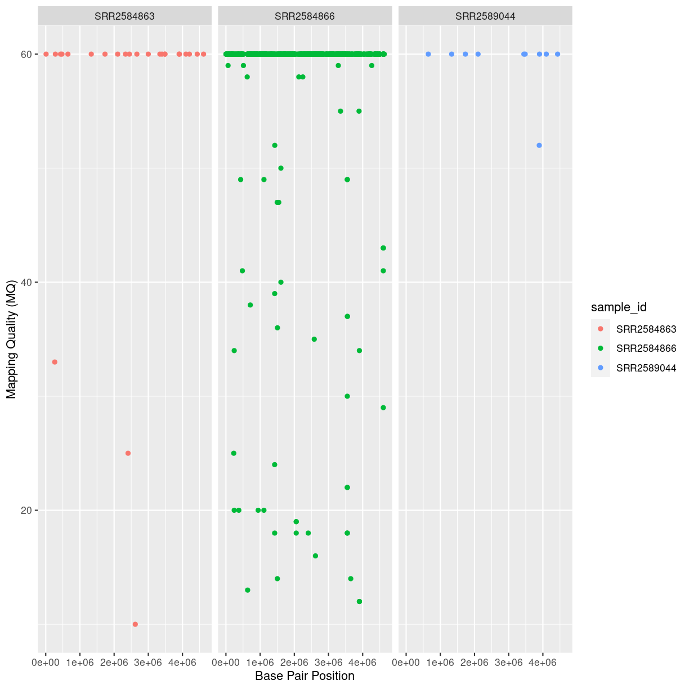

This looks okay, but it would be easier to read if the plot facets were stacked vertically rather than horizontally. The `facet_grid` geometry allows you to explicitly specify how you want your plots to be arranged via formula notation (`rows ~ columns`; a `.` can be used as a placeholder that indicates only one row or column).

~~~
ggplot(data = variants, aes(x = POS, y = MQ, color = sample_id)) +
 geom_point() +
 labs(x = "Base Pair Position",
      y = "Mapping Quality (MQ)") +
 facet_grid(sample_id ~ .)
~~~
{: .language-r}

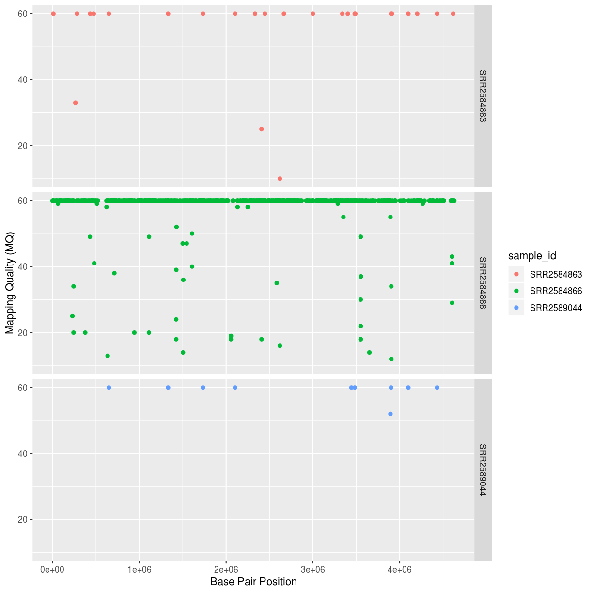

Usually plots with white background look more readable when printed.  We can set the background to white using the function `theme_bw()`. Additionally, you can remove the grid:

~~~
ggplot(data = variants, aes(x = POS, y = MQ, color = sample_id)) +
  geom_point() +
  labs(x = "Base Pair Position",
       y = "Mapping Quality (MQ)") +
  facet_grid(sample_id ~ .) +
  theme_bw() +
  theme(panel.grid = element_blank())
~~~
{: .language-r}

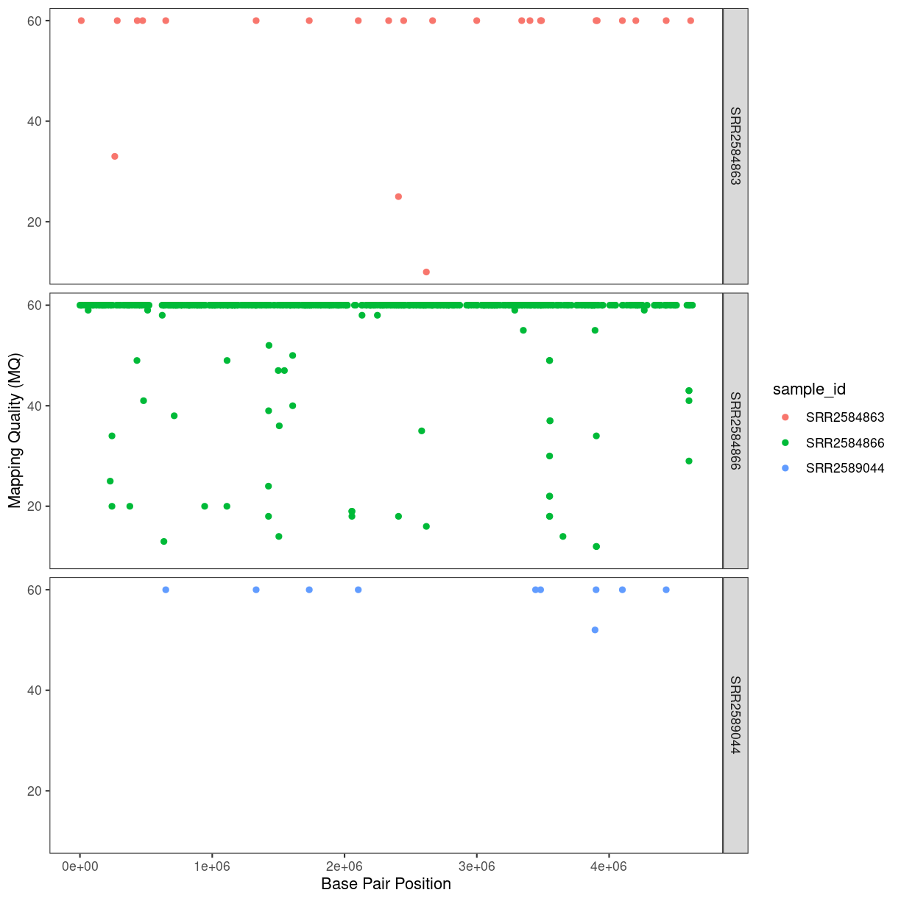

> ## Challenge
>
> Use what you just learned to create a scatter plot of PHRED scaled quality (`QUAL`) over
> position (`POS`) with the samples showing in different colors. Make sure to give your plot
> relevant axis labels.
>
> > ## Solution
> > 
> > ~~~
> >  ggplot(data = variants, aes(x = POS, y = QUAL, color = sample_id)) +
> >   geom_point() +
> >   labs(x = "Base Pair Position",
> >        y = "PHRED-sacled Quality (QUAL)") +
> >   facet_grid(sample_id ~ .)
> > ~~~
> > {: .language-r}
> > 
> > 
> {: .solution}
{: .challenge}

## Barplots

We can create barplots using the `geom_bar` geom. Let's make a barplot showing the number of variants for each sample that are indels.

~~~
ggplot(data = variants, aes(x = INDEL, fill = sample_id)) +
  geom_bar() +
  facet_grid(sample_id ~ .)
~~~
{: .language-r}

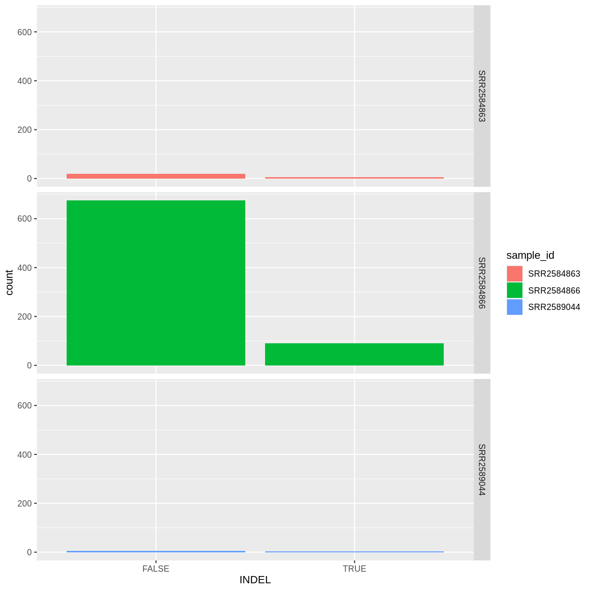

> ## Challenge
> Since we already have the sample_id labels on the individual plot facets, we don't need the
> legend. Use the help file for `geom_bar` and any other online resources you want to use to
> remove the legend from the plot.
>
>> ## Solution
>> 
>> ~~~
>> ggplot(data = variants, aes(x = INDEL, color = sample_id)) +
>>    geom_bar(show.legend = F) +
>>    facet_grid(sample_id ~ .)
>> ~~~
>> {: .language-r}
>> 
>> 
> {: .solution}
{: .challenge}

## Density

We can create density plots using the `geom_density` geom that shows the distribution of of a variable in the dataset. Let's plot the distribution of `DP`

~~~
ggplot(data = variants, aes(x = DP)) +
  geom_density()
~~~
{: .language-r}

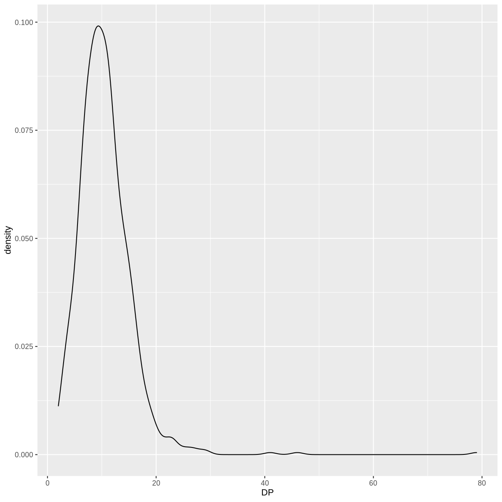

This plot tells us that the most of frequent `DP` (read depth) for the variants is about 10 reads.

> ## Challenge
> Use `geom_density` to plot the distribution of `DP` with a different fill for each sample. Use a white background for the plot.
>
>> ## Solution
>> 
>> ~~~
>> ggplot(data = variants, aes(x = DP, fill = sample_id)) +
>>    geom_density(alpha = 0.5) +
>>    theme_bw()
>> ~~~
>> {: .language-r}
>> 
>> 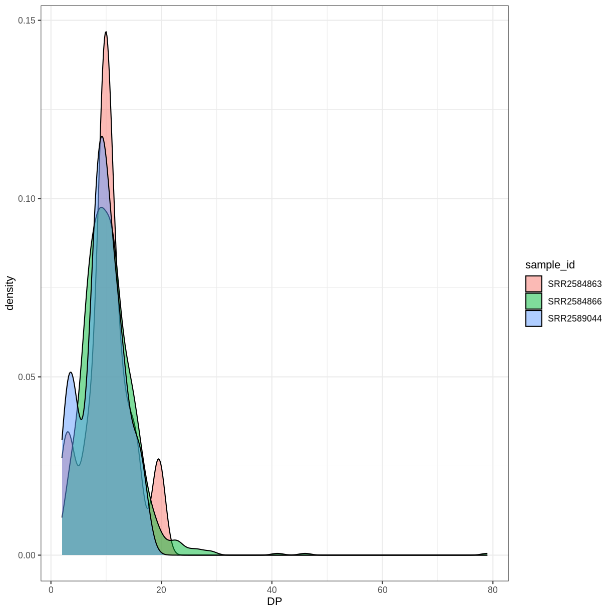
> {: .solution}
{: .challenge}

## **`ggplot2`** themes

In addition to `theme_bw()`, which changes the plot background to white, **`ggplot2`** comes with several other themes which can be useful to quickly change the look of your visualization. The complete list of themes is available at <https://ggplot2.tidyverse.org/reference/ggtheme.html>. `theme_minimal()` and `theme_light()` are popular, and `theme_void()` can be useful as a starting point to create a new hand-crafted theme.

The [ggthemes](https://jrnold.github.io/ggthemes/reference/index.html) package provides a wide variety of options (including an Excel 2003 theme). The [**`ggplot2`** extensions website](https://exts.ggplot2.tidyverse.org/) provides a list of packages that extend the capabilities of **`ggplot2`**, including additional themes.

> ## Challenge
>
> With all of this information in hand, please take another five minutes to
> either improve one of the plots generated in this exercise or create a
> beautiful graph of your own. Use the RStudio [**`ggplot2`** cheat sheet](https://github.com/rstudio/cheatsheets/raw/master/data-visualization-2.1.pdf)
> for inspiration. Here are some ideas:
>
> * See if you can change the size or shape of the plotting symbol.
> * Can you find a way to change the name of the legend? What about its labels?
> * Try using a different color palette (see
>   http://www.cookbook-r.com/Graphs/Colors_(ggplot2)/).
{: .challenge}

## More **`ggplot2`** Plots

**`ggplot2`** offers many more informative and beautiful plots of interest for biologists (although not covered in this lesson), such as [`geom_tile()`](https://ggplot2.tidyverse.org/reference/geom_tile.html) for heatmaps, [`geom_jitter()`](https://ggplot2.tidyverse.org/reference/geom_jitter.html) for stripcharts, and [`geom_violin()`](https://ggplot2.tidyverse.org/reference/geom_violin.html) for violin plots that are worth exploring.

