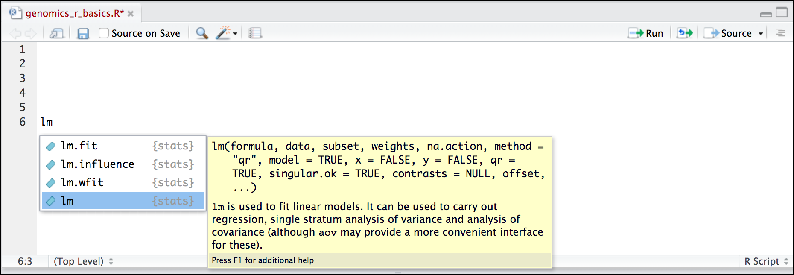

```{r, include = FALSE}
source("../bin/chunk-options.R")
knitr_fig_path("01-")
```

## Getting ready to use R for the first time

In this lesson we will take you through the very first things you need to get
R working.

> ## Tip: This lesson works best on the cloud
>
> Remember, these lessons assume we are using the pre-configured virtual machine
> instances provided to you at a genomics workshop. Much of this work could be
> done on your laptop, but we use instances to simplify workshop setup
> requirements, and to get you familiar with using the cloud (a common
> requirement for working with big data).
> Visit the [Genomics Workshop setup page](http://www.datacarpentry.org/genomics-workshop/setup.html)
> for details on getting this instance running on your own, or for the info you
> need to do this on your own computer.
{: .callout}


## A Brief History of R

[R](https://en.wikipedia.org/wiki/R_(programming_language)) has been around
since 1995, and was created by Ross Ihaka and Robert Gentleman at the University
of Auckland, New Zealand. R is based off the S programming language developed
at Bell Labs and was developed to teach intro statistics. See this [slide deck](https://www.stat.auckland.ac.nz/~ihaka/downloads/Massey.pdf)
by Ross Ihaka for more info on the subject.

## Advantages of using R

At more than 20 years old, R is fairly mature and [growing in popularity](https://www.tiobe.com/tiobe-index/r/). However, programming isn’t a popularity contest. Here are key advantages of
analyzing data in R:

 - **R is [open source](https://en.wikipedia.org/wiki/Open-source_software)**.
   This means R is free - an advantage if you are at an institution where you
   have to pay for your own MATLAB or SAS license. Open source, is important to
   your colleagues in parts of the world where expensive software in
   inaccessible. It also means that R is actively developed by a community (see
   [r-project.org](https://www.r-project.org/)),
   and there are regular updates.
 - **R is widely used**. Ok, maybe programming is a popularity contest. Because,
   R is used in many areas (not just bioinformatics), you are more likely to
   find help online when you need it. Chances are, almost any error message you
   run into, someone else has already experienced.
- **R is powerful**. R runs on multiple platforms (Windows/MacOS/Linux). It can
   work with much larger datasets than popular spreadsheet programs like
   Microsoft Excel, and because of its scripting capabilities is far more
   reproducible. Also, there are thousands of available software packages for
   science, including genomics and other areas of life science.

> ## Discussion: Your experience
>
> What has motivated you to learn R? Have you had a research question for which
> spreadsheet programs such as Excel have proven difficult to use, or where the
> size of the data set created issues?
{: .discussion}


## Introducing RStudio Server

In these lessons, we will be making use of a software called [RStudio](https://www.rstudio.com/products/RStudio/),
an [Integrated Development Environment (IDE)](https://en.wikipedia.org/wiki/Integrated_development_environment).
RStudio, like most IDEs, provides a graphical interface to R, making it more
user-friendly, and providing dozens of useful features. We will introduce
additional benefits of using RStudio as you cover the lessons. In this case,
we are specifically using [RStudio Server](https://www.rstudio.com/products/RStudio/#Server),
a version of RStudio that can be accessed in your web browser. RStudio Server
has the same features of the Desktop version of RStudio you could download as
standalone software.

## Log on to RStudio Server

Open a web browser and enter the IP address of your instance 
(provided by your instructors), followed by
`:8787`. For example, if your IP address was 123.45.67.89 your URL would be

```
http://123.45.67.89:8787
```

> ## Tip: Make sure there are no spaces before or after your URL or
> your web browser may interpret it as a search query.
{: .callout}

You should now be looking at a page that will allow you to login to the RStudio
server:


Enter your user credentials and click <kbd>Sign In</kbd>. The credentials for
the genomics Data Carpentry instances will be provided by your instructors. 

You should now see the RStudio interface:


## Create an RStudio project

One of the first benefits we will take advantage of in RStudio is something
called an **RStudio Project**. An RStudio project allows you to more easily:

- Save data, files, variables, packages, etc. related to a specific
  analysis project
- Restart work where you left off
- Collaborate, especially if you are using version control such as [git](http://swcarpentry.github.io/git-novice/).


1. To create a project, go to the <kbd>File</kbd> menu, and click <kbd>New Project...</kbd>.


2. In the window that opens select **New Directory**, then **New Project**. For
"Directory name:" enter **dc_genomics_r**. For "Create project as subdirectory of",
you may leave the default, which is your home directory "~".

3. Finally click <kbd>Create Project</kbd>. In the "Files" tab of your output
pane (more about the RStudio layout in a moment), you should see an RStudio
 project file, **dc_genomics_r.Rroj**. All RStudio projects end with the
 "**.Rproj**" file extension.

>## Tip: Make your project more reproducible with Packrat
> One of the most wonderful and also frustrating aspects of working with R is
> managing packages. We will talk more about them, but packages (e.g. ggplot2)
> are add-ons that extend what you can do with R. Unfortunately it is very
> common that you may run into versions of R and/or R packages that are not
> compatible. This may make it difficult for someone to run your R script using
> their version of R or a given R package, and/or make it more difficult to run
> their scripts on your machine. [Packrat](https://rstudio.github.io/packrat/)
> is an RStudio add-on that will associate your packages and project so that
> your work is more portable and reproducible. To turn on Packrat click on
> the <KBD>Tools</KBD> menu and select <KBD>Project Options</KBD>. Under
> **Packrat** check off "**Use packrat with this project**" and follow any
> installation instructions.
{: .callout}

## Creating your first R script

Now that we are ready to start exploring R, we will want to keep a record of the
commands we are using. To do this we can create an R script:

Click the <kbd>File</kbd> menu and select <kbd>New File</kbd> and then
<kbd>R Script</kbd>. Before we go any further, save your script by clicking the
save/disk icon that is in the bar above the first line in the script editor, or
click the <kbd>File</kbd> menu and select <kbd>save</kbd>. In the "Save File"
window that opens, name your file **"genomics_r_basics"**. The new script
**genomics_r_basics.R** should appear under "files" in the output pane. By
convention, R scripts end with the file extension **.R**.

## Overview and customization of the RStudio layout

Here are the major windows (or panes) of the RStudio
environment:


- **Source**: This pane is where you will write/view R scripts. Some outputs
  (such as if you view a dataset using `View()`) will appear as a tab here.
- **Console/Terminal**: This is actually where you see the execution of
  commands. This is the same display you would see if you were using R at the
  command line without RStudio. You can work interactively (i.e. enter R
  commands here), but for the most part we will run a script (or lines in a
  script) in the source pane and watch their execution and output here. The
  "Terminal" tab give you access to the BASH terminal (the Linux operating
  system, unrelated to R).
- **Environment/History**: Here, RStudio will show you what datasets and
  objects (variables) you have created and which are defined in memory.
  You can also see some properties of objects/datasets such as their type
  and dimensions. The "History" tab contains a history of the R commands you've executed R.
- **Files/Plots/Packages/Help**: This multipurpose pane will show you the
  contents of directories on your computer. You can also use the "Files" tab to
  navigate and set the working directory. The "Plots" tab will show the output
  of any plots generated. In "Packages" you will see what packages are actively
  loaded, or you can attach installed packages. "Help" will display help files
  for R functions and packages.

>## Tip: Uploads and downloads in the cloud
> In the "Files" tab you can select a file and download it from your cloud
> instance (click the "more" button) to your local computer.
> Uploads are also possible.
{: .callout}

All of the panes in RStudio have configuration options. For example, you can
minimize/maximize a pane, or by moving your mouse in the space between
panes you can resize as needed. The most important customization options for
pane layout are in the <KBD>View</KBD> menu. Other options such as font sizes,
colors/themes, and more are in the <KBD>Tools</KBD> menu under
<KBD>Global Options</KBD>.

>## You are working with R
> Although we won't be working with R at the terminal, there are lots of reasons
> to. For example, once you have written an RScript, you can run it at any Linux
> or Windows terminal without the need to start up RStudio. We don't want
> you to get confused - RStudio runs R, but R is not RStudio. For more on
> running an R Script at the terminal see this [Software Carpentry lesson](https://swcarpentry.github.io/r-novice-inflammation/05-cmdline/).
{: .callout}

## Getting to work with R: navigating directories
Now that we have covered the more aesthetic aspects of RStudio, we can get to
work using some commands. We will write, execute, and save the commands we
learn in our **genomics_r_basics.R** script that is loaded in the Source pane.
First, lets see what directory we are in. To do so, type the following command
into the script:

```{r, eval = FALSE, purl = FALSE}
getwd()
```

To execute this command, make sure your cursor is on the same line the command
is written. Then click the <KBD>Run</KBD> button that is just above the first
line of your script in the header of the Source pane.


In the console, we expect to see the following output*:

~~~
[1] "/home/dcuser/dc_genomics_r"
~~~
{: .output}

\* Notice, at the Console, you will also see the instruction you executed
above the output in blue.

Since we will be learning several commands, we may already want to keep some
short notes in our script to explain the purpose of the command. Entering a `#`
before any line in an R script turns that line into a comment, which R will
not try to interpret as code. Edit your script to include a comment on the
purpose of commands you are learning, e.g.:

```{r, eval = FALSE, purl = FALSE}
# this command shows the current working directory
getwd()
```

> ## Exercise: Work interactively in R
>
> What happens when you try to enter the `getwd()` command in the Console pane?
>
>> ## Solution
>> You will get the same output you did as when you ran `getwd()` from the
>> source. You can run any command in the Console, however, executing it from
>> the source script will make it easier for us to record what we have done,
>> and ultimately run an entire script, instead of entering commands one-by-one.
> {: .solution}
{: .challenge}

For the purposes of this exercise we want you to be in the directory `"/home/dcuser/R_data"`.
What if you weren't? You can set your home directory using the `setwd()`
command. Enter this command in your script, but *don't run* this yet.

```{r, eval = FALSE, purl = FALSE}
# This sets the working directory
setwd()
```

You may have guessed, you need to tell the `setwd()` command
what directory you want to set as your working directory. To do so, inside of
the parentheses, open a set of quotes. Inside the quotes enter a `/` which is
the root directory for Linux. Next, use the <KBD>Tab</KBD> key, to take
advantage of RStudio's Tab-autocompletion method, to select `home`, `dcuser`,
and `dc_genomics_r` directory. The path in your script should look like this:

```{r, eval = FALSE, purl = FALSE}
# This sets the working directory
setwd("/home/dcuser/dc_genomics_r")
```

When you run this command, the console repeats the command, but gives you no
output. Instead, you see the blank R prompt: `>`. Congratulations! Although it
seems small, knowing what your working directory is and being able to set your
working directory is the first step to analyzing your data.

> ## Tip: Never use `setwd()`
>
> Wait, what was the last 2 minutes about? Well, setting your working directory
> is something you need to do, you need to be very careful about using this as
> a step in your script. For example, what if your script is being on a computer
> that has a different directory structure? The top-level path in a Unix file
> system is root `/`, but on Windows it is likely `C:\`. This is one of several
> ways you might cause a script to break because a file path is configured
> differently than your script anticipates. R packages like [here](https://cran.r-project.org/web/packages/here/index.html)
> and [file.path](https://www.rdocumentation.org/packages/base/versions/3.4.3/topics/file.path)
> allow you to specify file paths is a way that is more operating system
> independent. See Jenny Bryan's [blog post](https://www.tidyverse.org/articles/2017/12/workflow-vs-script/) for this
> and other R tips.
{: .callout}

## Using functions in R, without needing to master them

A function in R (or any computing language) is a short
program that takes some input and returns some output. Functions may seem like an advanced topic (and they are), but you have already
used at least one function in R. `getwd()` is a function! The next sections will help you understand what is happening in
any R script.

> ## Exercise: What do these functions do?
>
> Try the following functions by writing them in your script. See if you can
> guess what they do, and make sure to add comments to your script about your
> assumed purpose.
> - `dir()`
> - `sessionInfo()`
> - `date()`
> - `Sys.time()`
>
>> ## Solution
>> - `dir()` # Lists files in the working directory
>> - `sessionInfo()` # Gives the version of R and additional info including
>>    on attached packages
>> - `date()` # Gives the current date
>> - `Sys.time()` # Gives the current time
>>
>> *Notice*: Commands are case sensitive!
> {: .solution}
{: .challenge}

You have hopefully noticed a pattern - an R
function has three key properties:
- Functions have a name (e.g. `dir`, `getwd`); note that functions are case
  sensitive!
- Following the name, functions have a pair of `()`
- Inside the parentheses, a function may take 0 or more arguments

An argument may be a specific input for your function and/or may modify the
function's behavior. For example the function `round()` will round a number
with a decimal:

```{r}
# This will round a number to the nearest integer
round(3.14)
```

## Getting help with function arguments

What if you wanted to round to one significant digit? `round()` can
do this, but you may first need to read the help to find out how. To see the help
(In R sometimes also called a "vignette") enter a `?` in front of the function
name:

```{r, eval=FALSE}
?round()
```

The "Help" tab will show you information (often, too much information). You
will slowly learn how to read and make sense of help files. Checking the "Usage" or "Examples"
headings is often a good place to look first. If you look under "Arguments," we
also see what arguments we can pass to this function to modify its behavior.
You can also see a function's argument using the `args()` function:

```{r}
args(round)
```

`round()` takes two arguments, `x`, which is the number to be 
rounded, and a
`digits` argument. The `=` sign indicates that a default (in this case 0) is
already set. Since `x` is not set, `round()` requires we provide it, in contrast
to `digits` where R will use the default value 0 unless you explicitly provide
a different value. We can explicitly set the digits parameter when we call the
function:

```{r}
round(3.14159, digits = 2)
```

Or, R accepts what we call "positional arguments", if you pass a function
arguments separated by commas, R assumes that they are in the order you saw
when we used `args()`. In the case below that means that `x` is 3.14159 and
digits is 2.

```{r}
round(3.14159, 2)
```

Finally, what if you are using `?` to get help for a function in a package not installed on your system, such as when you are running a script which has dependencies.

```{r, eval=FALSE}
?geom_point()
```

will return an error:

~~~
Error in .helpForCall(topicExpr, parent.frame()) :
   no methods for ‘geom_point’ and no documentation for it as a function
~~~
{: .error}

Use two question marks (i.e. `??geom_point()`) and R will return
results from a search of the documentation for packages you have installed on your computer
in the "Help" tab. Finally, if you think there
should be a function, for example a statistical test, but you aren't
sure what it is called in R, or what functions may be available, use
the `help.search()` function.

> ## Exercise: Searching for R functions
> Use `help.search()` to find R functions for the following statistical
> functions. Remember to put your search query in quotes inside the function's
> parentheses.
>
> - Chi-Squared test
> - Student-t test
> - mixed linear model
>
>> ## Solution
>>   While your search results may return several tests, we list a few you might
>>   find:
>> - Chi-Squared test: `stats::Chisquare`
>> - Student-t test: `stats::TDist`
>> - mixed linear model: `stats::lm.glm`
> {: .solution}
{: .challenge}


We will discuss more on where to look for the libraries and packages that contain functions you want to use. For now, be aware that two important ones are [CRAN](https://cran.r-project.org/) - the main repository for R, and [Bioconductor](http://bioconductor.org/) - a popular repository for bioinformatics-related R packages.

## RStudio contextual help

Here is one last bonus we will mention about RStudio. It's difficult to
remember all of the arguments and definitions associated with a given function.
When you start typing the name of a function and hit the <KBD>Tab</KBD> key,
RStudio will display functions and associated help:



Once you type a function, hitting the <KBD>Tab</KBD> inside the parentheses
will show you the function's arguments and provide additional help
for each of these arguments.


