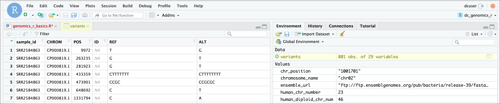

```{r, include=FALSE}
source("../bin/chunk-options.R")
knitr_fig_path("03-")
```


## Working with spreadsheets (tabular data)

A substantial amount of the data we work with in genomics will be tabular data,
this is data arranged in rows and columns - also known as spreadsheets. We could
write a whole lesson on how to work with spreadsheets effectively ([actually we did](http://www.datacarpentry.org/spreadsheet-ecology-lesson/)). For our
purposes, we want to remind you of a few principles before we work with our
first set of example data:

**1) Keep raw data separate from analyzed data**

This is principle number one because if you can't tell which files are the
original raw data, you risk making some serious mistakes (e.g. drawing conclusion
from data which have been manipulated in some unknown way).

**2) Keep spreadsheet data Tidy**

The simplest principle of **Tidy data** is that we have one row in our
spreadsheet for each observation or sample, and one column for every variable
that we measure or report on. As simple as this sounds, it's very easily
violated. Most data scientists agree that significant amounts of their time is
spent tidying data for analysis. Read more about data organization in
[our lesson](http://www.datacarpentry.org/spreadsheet-ecology-lesson/) and
in [this paper](https://www.jstatsoft.org/article/view/v059i10).

**3) Trust but verify**

Finally, while you don't need to be paranoid about data, you should have a plan
for how you will prepare it for analysis. **This a focus of this lesson.**
You probably already have a lot of intuition, expectations, assumptions about
your data - the range of values you expect, how many values should have
been recorded, etc. Of course, as the data get larger our human ability to
keep track will start to fail (and yes, it can fail for small data sets too).
R will help you to examine your data so that you can have greater confidence
in your analysis, and its reproducibility.

> ## Tip: Keeping you raw data separate
>
> When you work with data in R, you are not changing the original file you
> loaded that data from. This is different than (for example) working with
> a spreadsheet program where changing the value of the cell leaves you one
> "save"-click away from overwriting the original file. You have to purposely
> use a writing function (e.g. `write.csv()`) to save data loaded into R. In
> that case, be sure to save the manipulated data into a new file. More on this
> later in the lesson.  
 {: .callout}


## Importing tabular data into R
There are several ways to import data into R. For our purpose here, we will
focus on using the tools every R installation comes with (so called "base" R) to
import a comma-delimited file, a sequencing sample submission sheet. We will need to load the sheet using a function called `read.csv()`.

> ## Exercise: Review the arguments of the `read.csv()` function
>
> **Before using the `read.csv()` function, use R's help feature to answer the
> following questions**.
>
> *Hint*: Entering '?' before the function name and then running that line will
> bring up the help documentation. Also, when reading this particular help
> be careful to pay attention to the 'read.csv' expression under the 'Usage'
> heading. Other answers will be in the 'Arguments' heading.
>
> A) What is the default parameter for 'header' in the `read.csv()` function?
>
> B) What argument would you have to change to read a file that was delimited
> by semicolons (;) rather than commas?
>
> C) What argument would you have to change to read file in which numbers
> used commas for decimal separation (i.e. 1,00)?
>
> D) What argument would you have to change to read in only the first 10,000 rows
> of a very large file?
>
>> ## solution
>>
>> A) The `read.csv()` function has the argument 'header' set to TRUE by default,
>> this means the function always assumes the first row is header information,
>> (i.e. column names)
>>
>> B) The `read.csv()` function has the argument 'sep' set to ",". This means
>> the function assumes commas are used as delimiters, as you would expect.
>> Changing this parameter (e.g. `sep=";"`) would now interpret semicolons as
>> delimiters.
>>
>> C) Although it is not listed in the `read.csv()` usage, `read.csv()` is
>> a "version" of the function `read.table()` and accepts all its arguments.
>> If you set `dec=","` you could change the decimal operator. We'd probably
>> assume the delimiter is some other character.
>>
>> D) You can set `nrow` to a numeric value (e.g. `nrow=10000`) to choose how
>> many rows of a file you read in. This may be useful for very large files
>> where not all the data is needed to test some data cleaning steps you are
>> applying.
>>
>> Hopefully, this exercise gets you thinking about using the provided help
>> documentation in R. There are many arguments that exist, but which we wont
>> have time to cover. Look here to get familiar with functions you use
>> frequently, you may be surprised at what you find they can do.
> {: .solution}
{: .challenge}


Now, let's read in the file `sample_submission.csv` which will be located in
`/home/dcuser/dc_sample_data/R`. Save the file as `submission_metadata`. The
first argument to pass to our `read.csv()` function is the file path for our
data. The file path must be in quotes and now is a good time to remember to
use tab autocompletion. **If you use tab autocompletion you avoid typos and
errors in file paths.** Use it!

```{r}
## read in a CSV file and save it as 'submission_metadata'

submission_metadata <- read.csv("data/sample_submission.csv")
```

One of the first things you should notice is that in the Environment window,
you have the `submission_metadata` object, listed as 96 obs. (observations/rows)
of 10 variables (columns). Double-clicking on the name of the object will open
a view of the data in a new tab.



## Summarizing and determining the structure of a data frame.

A **data frame is the standard way in R to store tabular data**. A data fame
could also be thought of as a collect of vectors, all of which have the same
length. Using only two functions, we can learn a lot about out data frame
including some summary statics as well as well as the "structure" of the data
frame. Let's examine what each of these functions can tell us:

```{r}
## get summary statistics on a data frame

summary(submission_metadata)
```

Our data frame had 10 variables, so we get 10 fields that summarize the data.
The `tube_barcode`, `Volume..ul.`, `concentration..ng.ul`, `RIN`, variables are
numerical data and so you get summary statistics on the min and max values for
these columns, as well as mean, median, and interquartile ranges. The other data
(e.g. `replicate`, etc.) are treated as categorical data (which have special
treatment in R - more on this in a bit). The top 6 different categories and the
number of times they appear (e.g. the replicate called 'A' appeared 31 times)
are displayed. There was only one value for `ship_date`, "20-Jul" which appeared
96 times.

Before we operate on the data, we also need to know a little more about the
data frame structure to do that we use the `str()` function:

```{r}
## get the structure of a data frame

str(submission_metadata)
```

Ok, thats a lot up unpack! Some things to notice.

- the object type `data.frame` is displayed in the first row along with its
  dimensions, in this case 96 observations (rows) and 10 variables (columns)
- Each variable (column) has a name (e.g. `well_position`). This is followed
  by the object mode (e.g. factor, int, num, etc.). Notice that before each
  variable name there is a `$` - this will be important later.

## Introducing Factors

Factors are the final major data structure we will introduce in our R genomics
lessons. Factors can be thought of as vectors which are specialized for
categorical data. Given R's specialization for statistics, this make sense since
categorial and continuous variables usually have different treatments. Sometimes
you may want to have data treated as a factor, but in other cases, this may be
undesirable.

Since some of the data in our data frame are factors, lets see how factors work
using the `factor()` function to create a factor:

```{r}
## create a factor 'days of the week' by passing a vector of characters

days_of_the_week <- factor(c('monday',
                             'tuesday',
                             'wednesday',
                             'thursday',
                             'friday'))
```

Notice what happens when we run a line with just the name of our factor:

```{r}
# create a factor 'days of the week' by passing a vector of characters

days_of_the_week
```

What we get back are the items in our factor, and also something called "Levels".
**Levels are the different categories contained in a factor**. By default, R
will organize the levels in a factor in alphabetical order.

Lets look at the contents of a factor in a slightly different way using `str()`:

```{r}
str(days_of_the_week)
```

For the sake of efficiency, R stores the content of a factor as a vector of
integers, which an integer is assigned to each of the possible levels. Recall
levels are assigned in alphabetical order, so:

|Level|integer|
|-----|-------|
|friday|1|
|monday|2|
|thursday|3|
|tuesday|4|
|wednesday|5|

Notice what happens to the levels if we add some repeated values to our factor:

```{r}
# create a factor with repeated values
more_days_of_the_week <- factor(c('monday',
                                  'tuesday',
                                  'wednesday',
                                  'thursday',
                                  'friday',
                                  'friday',
                                  'friday'))
str(more_days_of_the_week)
```

Going back to our chart above, "friday" is assigned "1" in the factor, and that
integer is listed three times in our factor. This is slightly obscure, but it
provides some clarification to why we get this output.

## Plotting and ordering factors

One of the most common uses for factors will be when you plot categorical
values. For example, suppose we want to know how many samples from our sample
submission were prepped on each date? We could generate a plot:

```{r}
# create a factor with repeated values

plot(table(submission_metadata$prep_date))
```

Let's quickly brake down this line of code:

First we are pulling a single column of data from the `submission_metadata` data frame using `$` notation:

```{r}
# obtain the values of the 'prep_date' variable from the data frame

submission_metadata$prep_date
```

Then we use the `table()` function to turn this into a table of counts:

```{r}
# generate a table from values of the 'prep_date' variable from the data frame

table(submission_metadata$prep_date)
```

Finally, we use R's `plot()` function which attempts to generate a plot from the
data:

```{r}
# generate a plot from values of the 'prep_date' variable from the data frame

plot(table(submission_metadata$prep_date))
```

While this is a toy example, and there are problems with our prep dates that
need fixing, let's see how you order a factor so that we can fix our plot.
We can take our existing `more_days_of_the_week` factor, and use the `factor()`
function again. This time we will pass it two new arguments: `levels` will be
assigned to a vector that has the days of the week in the order we want them,
and we will set the `ordered` argument to TRUE.

```{r}
 # order the 'more_days_of_the_week' factor to our desired set of levels
 more_days_of_the_week <- factor(more_days_of_the_week, levels = c("monday",
                                                                   "tuesday",
                                                                   "wednesday",
                                                                   "thursday",
                                                                   "friday"),
                                 ordered = TRUE)
```        

We can now see the new ordering:

```{r}
str(more_days_of_the_week)
```

Although not all levels are shown, notice there are `<` signs indicating an
order.

> ## Exercise: Order and plot `sample_submission` `prep_date`
>
> **Generate a plot of the `prep_date` variable, properly ordered from the `sample_submission`
> data frame**
>
> To choose the ordering, assume that the unambiguous dates for this data are:
> - 7-Jun-15: June 7, 205
> - 6-Jul-15: July 6, 2015
> - 7/8/15: July 8, 2015
>
> *hint*: you can use the `factor()` function inside of your `table()`and `plot()`
> function calls.
>
> *hint*: build this single line of code from the inside out!
>
>> ## Solution
>>
>> ```{r}
>> plot(table(factor(submission_metadata$prep_date, levels = c("7-Jun-15",
>>                                                 "6-Jul-15",
>>                                                 "7/8/15"),
>>       ordered = TRUE)))
>> ```
>>
>>
> {: .solution}
{: .challenge}


## Subsetting data frames

Next, we are going to talk about how you can get specific values from data frames, and where necessary, change the mode of a column of values.

The first thing to remember is that a data frame is two-dimensional (rows and
columns). Therefore, to select a specific value we will will once again use
`[]` (bracket) notation, but we will specify more than one value (except in some cases
where we are taking a range).

> ## Exercise: Subsetting a data frame
>
> **Try the following indices and functions and try to figure out what they return**
>
> a. `submission_metadata[1,1]`
>
> b. `submission_metadata[2,4]`
>
> c. `submission_metadata[96,10]`
>
> d. `submission_metadata[2, ]`
>
> e. `submission_metadata[-1, ]`
>
> f. `submission_metadata[1:4,1]`
>
> g. `submission_metadata[1:10,c("client_sample_id","RIN")]`
>
> h. `submission_metadata[,c("RIN")]`
>
> i. `head(submission_metadata)`
>
> j. `tail(submission_metadata)`
>
> k. `submission_metadata$prep_date`
>
> l. `submission_metadata[submission_metadata$RIN >= 9.0,]`
>
>> ## solution
>>
>> a. `submission_metadata[1,1]` # 1st row, 1st column
>>
>> b. `submission_metadata[2,4]` # 2nd row, 4th column
>>
>> c. `submission_metadata[96,10]` # 96th row, 10th column
>>
>> d. `submission_metadata[2, ]` # The entire 2nd row
>>
>> e. `submission_metadata[-1, ]` # The entire data frame except the 1st row
>>
>> f. `submission_metadata[1:4,1]` # rows 1-4, column 1
>>
>> g. `submission_metadata[1:10,c("client_sample_id","client_sample_id")]` # rows 1:10, column 'client_sample_id' and 'RIN'
>>
>> h. `submission_metadata[,c("RIN")]` # all rows, column 'RIN'
>>
>> i. `head(submission_metadata)` # first 6 rows of the data frame
>>
>> j. `tail(submission_metadata)` # last 6 rows of the data frame
>>
>> k. `submission_metadata$prep_date` # "prep_date" column, all rows
>>
>> l. `submission_metadata[submission_metadata$RIN >= 9.0,]` # all rows where the value of "RIN" column is greater-than-or-equal-to 9.0
> {: .solution}
{: .challenge}

Essentially, the subsetting notation is very similar to what we learned for
vectors. The key differences include:

- Typically provide two values separated by commas: data.frame[row, column]
- In cases where you are taking a continuous range of numbers use a colon
  between the numbers (start:stop, inclusive)
- For a non continuous set of numbers, pass a vector using `c()`
- Index using the name of a column(s) by passing them as vectors using `c()`

Finally, in all of the subsetting exercises above, we simply printed values to
the screen. Remember that you can create a new data frame object by assigning
them to a new object name:

```{r}
# subset submission_metadata to a new data frame with RIN >= 8

high_quality_rna <- submission_metadata[submission_metadata$RIN >= 8,]

# check the dimension of the data frame

dim(high_quality_rna)

# get a summary of the data frame

summary(high_quality_rna)
```

## Coercing values in data frames

> ## Tip: coercion isn't limited to data frames
>
> While we are going to address coercion in the context of data frames
> most of these methods apply to other data structures, such as vectors
{: .callout}

Sometimes, it is possible that R will misinterpret the type of data represented
in a data frame, or store that data in a mode which prevents you from
operating on the data the way you wish. For example, a long list of gene names
isn't usually thought of as a categorical variable, the way that your
experimental condition (e.g. control, treatment) might be. More importantly,
some R packages you use to analyze your data may expect characters as input,
not factors. At other times (such as plotting or some statistical analyses) a
factor may be more appropriate. Ultimately, you should know how to change the
mode of an object.

First, its very important to recognize that coercion happens in R all the time.
This can be a good thing when R gets it right, or a bad thing when the result
is not what you expect. Consider:

```{r}
snp_chromosomes <- c('3', '11', 'X', '6')
typeof(snp_chromosomes)
```

Although there are several numbers in our vector, they are all in quotes, so
we have explicitly told R to consider them characters. However, even if we removed
the quotes from the numbers, R would coerce everything into a character:

```{r}
snp_chromosomes_2 <- c(3, 11, 'X', 6)
typeof(snp_chromosomes_2)
snp_chromosomes_2[1]
```

We can use the `as.` functions to explicitly coerce values from one form into
another. Consider the following vector of characters, which all happen to be
valid numbers:

```{r}
snp_positions_2 <- c("8762685", "66560624", "67545785", "154039662")
typeof(snp_positions_2)
snp_positions_2[1]
```

Now we can coerce `snp_positions_2` into a numeric type using `as.numeric()`:

```{r}
snp_positions_2 <- as.numeric(snp_positions_2)
typeof(snp_positions_2)
snp_positions_2[1]
```

Sometimes coercion is straight forward, but what would happen if we tried
using `as.numeric()` on `snp_chromosomes_2`

```{r}
snp_chromosomes_2 <- as.numeric(snp_chromosomes_2)
```

If we check, we will see that an `NA` value (R's default value for missing
data) has been introduced.

```{r}
snp_chromosomes_2
```

Trouble can really start when we try to coerce a factor. For example, when we
try to coerce the `replicate` column in our data frame into a character mode
look at the result:

```{r}
as.numeric(submission_metadata$replicate)
```

Strangely, it works! Almost. Instead of giving and error message, R returns
numeric values, which in this case are the integers assigned to the levels in
this factor. This kind of behavior can lead to hard-to-find bugs, for example
when we do have numbers in a factor, and we get numbers from a coercion. If
we don't look carefully, we may not notice a problem.

If you need to coerce an entire column you can overwrite it using an expression
like this one:

```{r}
# make the 'well_position' column a character type column
 
submission_metadata$well_position <- as.character(submission_metadata$well_position)

# check the type of the column
typeof(submission_metadata$well_position)
```

## StringsAsFactors=FALSE

Lets summarize this section on coercion with a few take home messages.

- When you explicitly coerce one data type into another (this is known as
  **explicit coercion**), be careful to check the result. Ideally, you should try to see if its possible to avoid steps in your analysis that force you to
  coerce.  
- R will sometimes coerce without you asking for it. This is called
  (appropriately) **implicit coercion**. For example when we tried to create
  a vector with multiple data types, R chose one type through implicit
  coercion.
- Check the structure (`str()`) of your data frames before working with them!

Regarding the first bullet point, one way to avoid needless coercion when
importing a data frame using any one of the `read.table()` functions such as
`read.csv()` is to set the argument `StringsAsFactors` to FALSE. By default,
this argument is TRUE. Setting it to FALSE will treat any non-numeric column to
a character type. `read.csv()` documentation, you will also see you can
explicitly type your columns using the `colClasses` argument. Other R packages
(such as the Tidyverse "readr") don't have this particular conversion issue,
but many packages will still try to guess a  data type.

## Data frame bonus material: math, sorting, renaming

Here are a few operations that don't need much explanation, but which are good
to know.

There are lots of arithmetic functions you may want to apply to your data
frame, covering those would be a course in itself (there is some starting
material [here](https://swcarpentry.github.io/r-novice-inflammation/15-supp-loops-in-depth/)). Our lessons will cover some additional summary statistical functions in
a subsequent lesson, but overall we will focus on data cleaning and
visualization.

As you might expect, you can use functions like `mean()`, `min()`, `max()` on an
individual column:

```{r}
mean(submission_metadata$RIN)
```

You can do math and save the result in a new column:

```{r}
submission_metadata$vol_in_L <- submission_metadata$Volume..µL. /10000
head(submission_metadata$vol_in_L)
```

You can sort a data frame using the `order()` function:

```{r}
sorted_by_replicate <- submission_metadata[order(submission_metadata$replicate), ]
head(sorted_by_replicate$replicate)
```

You can selectively replace values in a data frame based on their value:


```{r}
sorted_by_replicate$replicate[sorted_by_replicate$replicate == "a"] <- "A"
head(sorted_by_replicate$replicate)
```

You can rename columns:

```{r}
colnames(submission_metadata)[colnames(submission_metadata) == "Volume..µL."] <- "vol_in_µL"

# check the column name (hint names are returned as a vector)
colnames(submission_metadata)[6]
```

## Importing data from Excel

Excel is one of the most common formats, so we need to discuss how to make
these files play nicely with R. The simplest way to import data from Excel is
to **save your Excel file in .csv format***. You can then import into R right
away. Sometimes you may not be able to do this (imagine you have data in 300
Excel files, are you going to open and export all of them?).

One common R package (a set of code with features you can download and add to
your R installation) is the [readxl package](https://CRAN.R-project.org/package=readxl) which can open and import Excel
files. Rather than addressing package installation this second, we can take
advantage of RStudio's import feature which integrates this package. (Note:
this feature is available only in the latest versions of RStudio such as is
installed on our cloud instance).


First, in the RStudio menu go to **File**, select **Import Dataset**, and
choose **From Excel...** (notice there are several other options you can
explore).


Next, under **File/Url:** click the <KBD>Browse</KBD> button and navigate to the **Ecoli_metadata.xlsx** file located at `/home/dcuser/dc_sample_data/R`.
You should now see a preview of the data to be imported:


Notice that you have the option to change the data type of each variable by
clicking arrow (drop-down menu) next to each column title. Under **Import
Options** you may also rename the data, choose a different sheet to import, and
choose how you will handle headers and skipped rows. Under **Code Preview** you
can see the code that will be used to import this file. We could have written
this code and imported the Excel file without the RStudio import function, but
now you can choose your preference.

In this exercise, we will leave the title of the data frame as
**Ecoli_metadata**, and there are no other options we need to adjust. Click the
<KBD>Import</KBD> button to import the data.

Finally, let's check the first few lines of the `Ecoli_metadata` metadata data
frame:

```{r, echo=FALSE}
## read the file but don't show the code so the rest of the episode works
Ecoli_metadata <-  readxl::read_xlsx("data/Ecoli_metadata.xlsx")
```

```{r}
head(Ecoli_metadata)
```

Works as we expect! Notice the type of this object is 'tibble', a type of data
frame we will talk more about in the 'dplyr' section. Of course, if you needed
a true R data frame you could coerce with `as.data.frame()`.

## Saving your data frame to a file

Finally, we can conclude this episode with saving our data frame, in this case
to a .csv file using the `write.csv()` function:

```{r}
write.csv(submission_metadata, file = "submission_metatata_cleaned.csv")
```
The `write.csv()` function has some additional arguments listed in the help, but
at a minimum you need to tell it what data frame to write to file, and give a
path to a file name in quotes (if you only provide a file name, the file will
be written in the current working directory).

> ## Exercise: Putting it all together - data frames
>
> **Using the `Ecoli_metadata` data frame created above, answer the following questions**
>
> *Hint*: If you did not create the `Ecoli_metadata` data frame, use the
> instructions above (Importing data from Excel section) to create this object.
>
> A) What are the dimensions (# rows, #columns) of the data frame?
>
> B) What are categories are there in the `cit` column? *hint*: treat column as factor
>
> C) How many of each of the `cit` categories are there?
>
> D) What is the genome size for the 7th observation in this data set?
>
> E) What is the median value of the variable `genome_size`
>
> F) Rename the column `sample` to `sample_id`
>
> G) Create a new column (name genome_size_bp) and set it equal to the genome_size multiplied by 1,000,000
>
> H) Save the edited Ecoli_metadata data frame as "exercise_solution.csv" in your current working directory.
>
>> ## Solution
>>
>> A) `dim(Ecoli_metadata)` # (30 rows, 7 columns)
>>
>> B) `levels(as.factor(Ecoli_metadata$cit))` # "minus"   "plus"    "unknown"
>>
>> C) `table(as.factor(Ecoli_metadata$cit))` # 9 minus, 9 plus, 12 unknown
>>
>> D) `Ecoli_metadata[7,7]` # 4.62
>>
>> E) `median(Ecoli_metadata$genome_size)` # 4.625
>>
>> F) `colnames(Ecoli_metadata)[colnames(Ecoli_metadata) == "sample"]<- "sample_id"`
>>
>> G) `Ecoli_metadata$genome_size_bp <- Ecoli_metadata$genome_size * 1000000`
>>
>> H) `write.csv(Ecoli_metadata, file= "exercise_solution.csv")`
> {: .solution}
{: .challenge}

