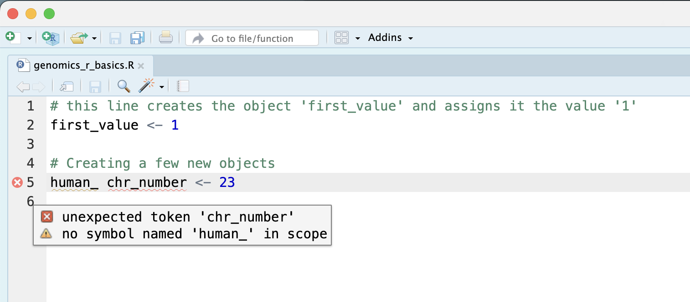

```{r, include = FALSE}
source("../bin/chunk-options.R")
knitr_fig_path("02-")
```

## "The fantastic world of R awaits you" OR "Nobody wants to learn how to use R"

Before we begin this lesson, we want you to be clear on the goal of the workshop
and these lessons. We believe that every learner can **achieve competency
with R**. You have reached competency when you find that you are able to
**use R to handle common analysis challenges in a reasonable amount of time**
(which includes time needed to look at learning materials, search for answers
online, and ask colleagues for help). As you spend more time using R (there is
no substitute for regular use and practice) you will find yourself gaining
competency and even expertise. The more familiar you get, the more
complex the analyses you will be able to carry out, with less frustration, and
in less time - the fantastic world of R awaits you!

## What these lessons will not teach you

Nobody wants to learn how to use R. People want to learn how to use R to analyze
their own research questions! Ok, maybe some folks learn R for R's sake, but
these lessons assume that you want to start analyzing genomic data as soon as
possible. Given this, there are many valuable pieces of information about R
that we simply won't have time to cover. Hopefully, we will clear the hurdle of
giving you just enough knowledge to be dangerous, which can be a high bar
in R! We suggest you look into the additional learning materials in the tip box
below.

**Here are some R skills we will *not* cover in these lessons**

- How to create and work with R matrices and R lists
- How to create and work with loops and conditional statements, and the "apply"
  family of functions (which are super useful, read more [here](https://www.r-bloggers.com/r-tutorial-on-the-apply-family-of-functions/))
- How to do basic string manipulations (e.g. finding patterns in text using grep, replacing text)
- How to plot using the default R graphic tools (we *will* cover plot creation, but will do so using the popular plotting package `ggplot2`)
- How to use advanced R statistical functions

> ## Tip: Where to learn more
> The following are good resources for learning more about R. Some of them
> can be quite technical, but if you are a regular R user you may ultimately
> need this technical knowledge.
> - [R for Beginners](https://cran.r-project.org/doc/contrib/Paradis-rdebuts_en.pdf):
    By Emmanuel Paradis and a great starting point
> - [The R Manuals](https://cran.r-project.org/manuals.html): Maintained by the
    R project
> - [R contributed documentation](https://cran.r-project.org/other-docs.html):
    Also linked to the R project; importantly there are materials available in
    several languages
> - [R for Data Science](http://r4ds.had.co.nz/): A wonderful collection by
    noted R educators and developers Garrett Grolemund and Hadley Wickham
> - [Practical Data Science for Stats](https://peerj.com/collections/50-practicaldatascistats/):
    Not exclusively about R usage, but a nice collection of pre-prints on data science
    and applications for R
> - [Programming in R Software Carpentry lesson](https://software-carpentry.org/lessons/):
    There are several Software Carpentry lessons in R to choose from
{: .callout}

## Creating objects in R

> ## Reminder
>
> At this point you should be coding along in the "**genomics_r_basics.R**"
> script we created in the last episode. Writing your commands in the script
> (and commenting it) will make it easier to record what you did and why.
{: .prereq}

What might be called a variable in many languages is called an **object**
in R.

**To create an object you need:**

- a name (e.g. 'a')
- a value (e.g. '1')
- the assignment operator ('<-')

In your script, "**genomics_r_basics.R**", using the R assignment operator '<-',
assign '1' to the object 'a' as shown. Remember to leave a comment in the line
above (using the '#') to explain what you are doing:

```{r, purl = FALSE}
# this line creates the object 'a' and assigns it the value '1'

a <- 1
```

Next, run this line of code in your script. You can run a line of code
by hitting the <KBD>Run</KBD> button that is just above the first line of your
script in the header of the Source pane or you can use the appropriate shortcut:

- Windows execution shortcut: <KBD>Ctrl</KBD>+<KBD>Enter</KBD>
- Mac execution shortcut: <KBD>Cmd(⌘)</KBD>+<KBD>Enter</KBD>

To run multiple lines of code, you can highlight all the line you wish to run
and then hit <KBD>Run</KBD> or use the shortcut key combo listed above.

In the RStudio 'Console' you should see:

~~~
a <- 1
>
~~~
{: .output}

The 'Console' will display lines of code run from a script and any outputs or
status/warning/error messages (usually in red).

In the 'Environment' window you will also get a table:

|Values||
|------|-|
|a|1|

The 'Environment' window allows you to keep track of the objects you have
created in R.

> ## Exercise: Create some objects in R
>
> Create the following objects; give each object an appropriate name
> (your best guess at what name to use is fine):
>
> 1. Create an object that has the value of number of pairs of human chromosomes
> 2. Create an object that has a value of your favorite gene name
> 3. Create an object that has this URL as its value: "ftp://ftp.ensemblgenomes.org/pub/bacteria/release-39/fasta/bacteria_5_collection/escherichia_coli_b_str_rel606/"
> 4. Create an object that has the value of the number of chromosomes in a
> diploid human cell
>
>> ## Solution
>>
>> Here as some possible answers to the challenge:
>> ```{r, purl = FALSE}
>> human_chr_number <- 23
>> gene_name <- 'pten'
>> ensemble_url <- 'ftp://ftp.ensemblgenomes.org/pub/bacteria/release-39/fasta/bacteria_5_collection/escherichia_coli_b_str_rel606/'
>> human_diploid_chr_num <-  2 * human_chr_number
>> ```
> {: .solution}
{: .challenge}

## Naming objects in R

Here are some important details about naming objects in R.

- **Avoid spaces and special characters**: Object names cannot contain spaces or the minus sign (`-`). You can use '_' to make names more readable. You should avoid
  using special characters in your object name (e.g. ! @ # . , etc.). Also,
  object names cannot begin with a number.
- **Use short, easy-to-understand names**: You should avoid naming your objects
  using single letters (e.g. 'n', 'p', etc.). This is mostly to encourage you
  to use names that would make sense to anyone reading your code (a colleague,
  or even yourself a year from now). Also, avoiding excessively long names will
  make your code more readable.
- **Avoid commonly used names**: There are several names that may already have a
  definition in the R language (e.g. 'mean', 'min', 'max'). One clue that a name
  already has meaning is that if you start typing a name in RStudio and it gets
  a colored highlight or RStudio gives you a suggested autocompletion you have
  chosen a name that has a reserved meaning.
- **Use the recommended assignment operator**: In R, we use '<- ' as the
  preferred assignment operator. '=' works too, but is most commonly used in
  passing arguments to functions (more on functions later). There is a shortcut
  for the R assignment operator:
  - Windows execution shortcut: <KBD>Alt</KBD>+<KBD>-</KBD>
  - Mac execution shortcut: <KBD>Option</KBD>+<KBD>-</KBD>

There are a few more suggestions about naming and style you may want to learn
more about as you write more R code. There are several "style guides" that
have advice, and one to start with is the [tidyverse R style guide](http://style.tidyverse.org/index.html).

> ## Tip: Pay attention to warnings in the script console
>
> If you enter a line of code in your script that contains an error, RStudio
> may give you an error message and underline this mistake. Sometimes these
> messages are easy to understand, but often the messages may need some figuring
> out. Paying attention to these warnings will help you avoid mistakes. In the example below, our object name has a space, which
> is not allowed in R. The error message does not say this directly,
> but R is "not sure"
> about how to assign the name to "human_ chr_number" when the object name we
> want is "human_chr_number".
>
> 
{: .callout}

## Reassigning object names or deleting objects

Once an object has a value, you can change that value by overwriting it. R will
not give you a warning or error if you overwriting an object, which
may or may not be a good thing
depending on how you look at it.

```{r, purl = FALSE}
# gene_name has the value 'pten' or whatever value you used in the challenge.
# We will now assign the new value 'tp53'
gene_name <- 'tp53'
```

You can also remove an object from R's memory entirely. The `rm()` function
will delete the object.

```{r, purl = FALSE, eval = FALSE}
# delete the object 'gene_name'
rm(gene_name)
```

If you run a line of code that has only an object name, R will normally display
the contents of that object. In this case, we are told the object no
longer exists.

~~~
Error: object 'gene_name' not found
~~~
{: .error}

## Understanding object data types (modes)

In R, **every object has two properties**:

- **Length**: How many distinct values are held in that object
- **Mode**: What is the classification (type) of that object.

We will get to the "length" property later in the lesson. The **"mode" property**
**corresponds to the type of data an object represents**. The most common modes
you will encounter in R are:

|Mode (abbreviation)|Type of data|
|----|------------|
|Numeric (num)| Numbers such floating point/decimals (1.0, 0.5, 3.14), there are also more specific numeric types (dbl - Double, int - Integer). These differences are not relevant for most beginners and pertain to how these values are stored in memory |
|Character (chr)|A sequence of letters/numbers in single '' or double " " quotes|
|Logical| Boolean values - TRUE or FALSE|

There are a few other modes (i.e. "complex", "raw" etc.) but these
are the three we will work with in this lesson.

Data types are familiar in many programming languages, but also in natural
language where we refer to them as the parts of speech, e.g. nouns, verbs,
adverbs, etc. Once you know if a word - perhaps an unfamiliar one - is a noun,
you can probably guess you can count it and make it plural if there is more than
one (e.g. 1 [Tuatara](https://en.wikipedia.org/wiki/Tuatara), or 2 Tuataras). If
something is a adjective, you can usually change it into an adverb by adding
"-ly" (e.g. [jejune](https://www.merriam-webster.com/dictionary/jejune) vs.
jejunely). Depending on the context, you may need to decide if a word is in one
category or another (e.g "cut" may be a noun when it's on your finger, or a verb
when you are preparing vegetables). These concepts have important analogies when
working with R objects.

> ## Exercise: Create objects and check their modes
>
> Create the following objects in R, then use the `mode()` function to verify
> their modes. Try to guess what the mode will be before you look at the solution
>
> 1. `chromosome_name <- 'chr02'`
> 2. `od_600_value <- 0.47`
> 3. `chr_position <- '1001701'`
> 4. `spock <- TRUE`
> 5. `pilot <- Earhart`
>
>> ## Solution
>> ```{r, echo = FALSE, purl = FALSE}
>> chromosome_name <- 'chr02'
>> od_600_value <- 0.47
>> chr_position <- '1001701'
>> spock <- TRUE
>> pilot <- Earhart
>> ```
>> 
>> ```{r, purl = FALSE}
>> mode(chromosome_name)
>> mode(od_600_value)
>> mode(chr_position)
>> mode(spock)
>> mode(pilot)
>> ```
> {: .solution}
{: .challenge}

Notice from the solution that even if a series of numbers are given as a value
R will consider them to be in the "character" mode if they are enclosed as
single or double quotes. Also, notice that you cannot take a string of alphanumeric
characters (e.g. Earhart) and assign as a value for an object. In this case,
R looks for an object named `Earhart` but since there is no object, no assignment can
be made. If `Earhart` did exist, then the mode of `pilot` would be whatever
the mode of `Earhart` was originally. If we want to create an object
called `pilot` that was the **name** "Earhart", we need to enclose
`Earhart` in quotation marks. 

```{r, purl = FALSE}
pilot <- "Earhart"
mode(pilot)
```

## Mathematical and functional operations on objects

Once an object exists (which by definition also means it has a mode), R can
appropriately manipulate that object. For example, objects of the numeric modes
can be added, multiplied, divided, etc. R provides several mathematical
(arithmetic) operators including:

|Operator|Description|
|--------|-----------|
|+|addition|
|-|subtraction|
|*|multiplication|
|/|division|
|^ or **|exponentiation|
|a%%b|modulus (returns the remainder after division)|

These can be used with literal numbers:

```{r, purl = FALSE}
(1 + (5 ** 0.5))/2
```

and importantly, can be used on any object that evaluates to (i.e. interpreted
by R) a numeric object:

```{r, echo = FALSE, purl = FALSE}
human_chr_number <- 23
```

```{r, purl = FALSE}
# multiply the object 'human_chr_number' by 2

human_chr_number * 2
```

> ## Exercise: Compute the golden ratio
>
> One appoximation of the golden ratio (φ) can be found by taking the sum of 1
> and the square root of 5, and dividing by 2 as in the example above. Compute
> the golden ratio to 3 digits of precision using the `sqrt()` and `round()`
> functions. Hint: remember the `round()` function can take 2 arguments.
>
>> ## Solution
>> ```{r, purl = FALSE}
>> round((1 + sqrt(5))/2, digits = 3)
>> ```
>> Notice that you can place one function inside of another.
> {: .solution}
{: .challenge}

## Vectors

Vectors are probably the
most used commonly used object type in R. 
**A vector is a collection of values that are all of the same type (numbers, characters, etc.)**. 
One of the most common
ways to create a vector is to use the `c()` function - the "concatenate" or
"combine" function. Inside the function you may enter one or more values; for
multiple values, separate each value with a comma:

```{r, purl = FALSE}
# Create the SNP gene name vector

snp_genes <- c("OXTR", "ACTN3", "AR", "OPRM1")
```

Vectors always have a **mode** and a **length**.
You can check these with the `mode()` and `length()` functions respectively.
Another useful function that gives both of these pieces of information is the
`str()` (structure) function.

```{r, purl = FALSE}
# Check the mode, length, and structure of 'snp_genes'
mode(snp_genes)
length(snp_genes)
str(snp_genes)
```

Vectors are quite important in R. Another data type that we will
work with later in this lesson, data frames, are collections of
vectors. What we learn here about vectors will pay off even more
when we start working with data frames. 

## Creating and subsetting vectors

Let's create a few more vectors to play around with:

```{r, purl = FALSE}
# Some interesting human SNPs
# while accuracy is important, typos in the data won't hurt you here

snps <- c('rs53576', 'rs1815739', 'rs6152', 'rs1799971')
snp_chromosomes <- c('3', '11', 'X', '6')
snp_positions <- c(8762685, 66560624, 67545785, 154039662)
```

Once we have vectors, one thing we may want to do is specifically retrieve one
or more values from our vector. To do so, we use **bracket notation**. We type
the name of the vector followed by square brackets. In those square brackets
we place the index (e.g. a number) in that bracket as follows:

```{r, purl = FALSE}
# get the 3rd value in the snp_genes vector
snp_genes[3]
```

In R, every item your vector is indexed, starting from the first item (1)
through to the final number of items in your vector. You can also retrieve a
range of numbers:

```{r, purl = FALSE}
# get the 1st through 3rd value in the snp_genes vector

snp_genes[1:3]
```

If you want to retrieve several (but not necessarily sequential) items from
a vector, you pass a **vector of indices**; a vector that has the numbered
positions you wish to retrieve.

```{r, purl = FALSE}
# get the 1st, 3rd, and 4th value in the snp_genes vector

snp_genes[c(1, 3, 4)]
```

There are additional (and perhaps less commonly used) ways of subsetting a
vector (see [these
examples](https://thomasleeper.com/Rcourse/Tutorials/vectorindexing.html)).
Also, several of these subsetting expressions can be combined:

```{r, purl = FALSE}
# get the 1st through the 3rd value, and 4th value in the snp_genes vector
# yes, this is a little silly in a vector of only 4 values.
snp_genes[c(1:3,4)]
```

## Adding to, removing, or replacing values in existing vectors

Once you have an existing vector, you may want to add a new item to it. To do
so, you can use the `c()` function again to add your new value:

```{r, purl = FALSE}
# add the gene 'CYP1A1' and 'APOA5' to our list of snp genes
# this overwrites our existing vector
snp_genes <- c(snp_genes, "CYP1A1", "APOA5")
```

We can verify that "snp_genes" contains the new gene entry

```{r, purl = FALSE}
snp_genes
```

Using a negative index will return a version a vector with that index's
value removed:

```{r, purl = FALSE}
snp_genes[-6]
```

We can remove that value from our vector by overwriting it with this expression:

```{r, purl = FALSE}
snp_genes <- snp_genes[-6]
snp_genes
```

We can also explicitly rename or add a value to our index using double bracket notation:

```{r, purl = FALSE}
snp_genes[[7]]<- "APOA5"
snp_genes
```

Notice in the operation above that R inserts an `NA` value to extend our vector so that the gene "APOA5" is an index 7. This may be a good or not-so-good thing depending on how you use this.

> ## Exercise: Examining and subsetting vectors
> Answer the following questions to test your knowledge of vectors
>
> Which of the following are true of vectors in R?
> A) All vectors have a mode **or** a length  
> B) All vectors have a mode **and** a length  
> C) Vectors may have different lengths  
> D) Items within a vector may be of different modes  
> E) You can use the `c()` to one or more items to an existing vector  
> F) You can use the `c()` to add a vector to an exiting vector  
>>
>> ## Solution
>>
>> A) False - Vectors have both of these properties  
>> B) True  
>> C) True  
>> D) False - Vectors have only one mode (e.g. numeric, character); all items in  
>> a vector must be of this mode.
>> E) True  
>> F) True  
> {: .solution}
{: .challenge}

## Logical Subsetting

There is one last set of cool subsetting capabilities we want to introduce. It is possible within R to retrieve items in a vector based on a logical evaluation or numerical comparison. For example, let's say we wanted get all of the SNPs in our vector of SNP positions that were greater than 100,000,000. We could index using the '>' (greater than) logical operator:

```{r, purl = FALSE}
snp_positions[snp_positions > 100000000]
```

In the square brackets you place the name of the vector followed by the comparison operator and (in this case) a numeric value. Some of the most common logical operators you will use in R are:

  | Operator | Description              |
  |----------|--------------------------|
  | <        | less than                |
  | <=       | less than or equal to    |
  | >        | greater than             |
  | >=       | greater than or equal to |
  | ==       | exactly equal to         |
  | !=       | not equal to             |
  | !x       | not x                    |
  | a \| b   | a or b                   |
  | a & b    | a and b                  |


> ## The magic of programming
>
> The reason why the expression `snp_positions[snp_positions > 100000000]` works
> can be better understood if you examine what the expression "snp_positions > 100000000"
>evaluates to:
>
> ```{r, purl = FALSE}
> snp_positions > 100000000
> ```
>
> The output above is a logical vector, the 4th element of which is TRUE. When
> you pass a logical vector as an index, R will return the true values:
>
> ```{r, purl = FALSE}
> snp_positions[c(FALSE, FALSE, FALSE, TRUE)]
> ```
>
> If you have never coded before, this type of situation starts to expose the
> "magic" of programming. We mentioned before that in the bracket notation you
> take your named vector followed by brackets which contain an index:
> **named_vector[index]**. The "magic" is that the index needs to *evaluate to*
> a number. So, even if it does not appear to be an integer (e.g. 1, 2, 3), as
> long as R can evaluate it, we will get a result. That our expression
> `snp_positions[snp_positions > 100000000]` evaluates to a number can be seen
> in the following situation. If you wanted to know which **index** (1, 2, 3, or
> 4) in our vector of SNP positions was the one that was greater than
> 100,000,000?
>
> We can use the `which()` function to return the indices of any item that
> evaluates as TRUE in our comparison:
>
> ```{r, purl = FALSE}
> which(snp_positions > 100000000)
> ```
>
> **Why this is important**
>
> Often in programming we will not know what inputs
> and values will be used when our code is executed. Rather than put in a
> pre-determined value (e.g 100000000) we can use an object that can take on
> whatever value we need. So for example:
>
> ```{r, purl = FALSE}
> snp_marker_cutoff <- 100000000
> snp_positions[snp_positions > snp_marker_cutoff]
> ```
>
> Ultimately, it's putting together flexible, reusable code like this that gets
> at the "magic" of programming!
{: .callout}

## A few final vector tricks

Finally, there are a few other common retrieve or replace operations you may
want to know about. First, you can check to see if any of the values of your
vector are missing (i.e. are `NA`). Missing data will get a more detailed treatment later,
but the `is.NA()` function will return a logical vector, with TRUE for any NA
value:

```{r, purl = FALSE}
# current value of 'snp_genes': 
# chr [1:7] "OXTR" "ACTN3" "AR" "OPRM1" "CYP1A1" NA "APOA5"

is.na(snp_genes)
```

Sometimes, you may wish to find out if a specific value (or several values) is
present a vector. You can do this using the comparison operator `%in%`, which
will return TRUE for any value in your collection that is in
the vector you are searching:

```{r, purl = FALSE}
# current value of 'snp_genes':
# chr [1:7] "OXTR" "ACTN3" "AR" "OPRM1" "CYP1A1" NA "APOA5"

# test to see if "ACTN3" or "APO5A" is in the snp_genes vector
# if you are looking for more than one value, you must pass this as a vector

c("ACTN3","APOA5") %in% snp_genes
```

> ## Review Exercise 1
>
> What data types/modes are the following vectors?
>    a. `snps`  
>    b. `snp_chromosomes`  
>    c. `snp_positions`  
> 
>> ## Solution
>> 
>> ```{r, purl = FALSE}
>> typeof(snps)
>> typeof(snp_chromosomes)
>> typeof(snp_positions)
>> ```
> {: .solution}
{: .challenge}

> ## Review Exercise 2
>
> Add the following values to the specified vectors:
>    a. To the `snps` vector add: 'rs662799'  
>    b. To the `snp_chromosomes` vector add: 11  
>    c. To the `snp_positions` vector add: 	116792991  
> 
>> ## Solution
>> 
>> ```{r, purl = FALSE}
>> snps <- c(snps, 'rs662799')
>> snps
>> snp_chromosomes <- c(snp_chromosomes, "11") # did you use quotes?
>> snp_chromosomes
>> snp_positions <- c(snp_positions, 116792991)
>> snp_positions
>> ```
> {: .solution}
{: .challenge}

> ## Review Exercise 3
> Make the following change to the `snp_genes` vector:
> 
> Hint: Your vector should look like this in 'Environment':
> `chr [1:7] "OXTR" "ACTN3" "AR" "OPRM1" "CYP1A1" NA "APOA5"`. If not
> recreate the vector by running this expression:
> `snp_genes <- c("OXTR", "ACTN3", "AR", "OPRM1", "CYP1A1", NA, "APOA5")`
>
>    a. Create a new version of `snp_genes` that does not contain CYP1A1 and then  
>    b. Add 2 NA values to the end of `snp_genes`  
> 
>> ## Solution
>> 
>> ```{r, purl = FALSE}
>> snp_genes <- snp_genes[-5]
>> snp_genes <- c(snp_genes, NA, NA)
>> snp_genes
>> ```
> {: .solution}
{: .challenge}

> ## Review Exercise 4
> 
> Using indexing, create a new vector named `combined` that contains:
>    - The the 1st value in `snp_genes`
>    - The 1st value in `snps`
>    - The 1st value in `snp_chromosomes`
>    - The 1st value in `snp_positions`
> 
>> ## Solution
>> 
>> ```{r, purl = FALSE}
>> combined <- c(snp_genes[1], snps[1], snp_chromosomes[1], snp_positions[1])
>> combined
>> ```
> {: .solution}
{: .challenge}


> ## Review Exercise 5
> What type of data is `combined`?
> 
>> ## Solution
>> 
>> ```{r, purl = FALSE}
>> typeof(combined)
>> ```
> {: .solution}
{: .challenge}

## Bonus material: Lists

Lists are quite useful in R, but we won't be using them in the genomics lessons.
That said, you may come across lists in the way that some bioinformatics
programs may store and/or return data to you. One of the key attributes of a
list is that, unlike a vector, a list may contain data of more than one mode.
Learn more about creating and using lists using this [nice
tutorial](http://r4ds.had.co.nz/lists.html). In this one example, we will create
a named list and show you how to retrieve items from the list.

```{r, purl = FALSE}
# Create a named list using the 'list' function and our SNP examples
# Note, for easy reading we have placed each item in the list on a separate line
# Nothing special about this, you can do this for any multiline commands
# To run this command, make sure the entire command (all 4 lines) are highlighted
# before running
# Note also, as we are doing all this inside the list() function use of the
# '=' sign is good style
snp_data <- list(genes = snp_genes,
                 refference_snp = snps,
                 chromosome = snp_chromosomes,
                 position = snp_positions)
# Examine the structure of the list
str(snp_data)
```


To get all the values for the `position` object in the list, we use the `$` notation:

```{r, purl = FALSE}
# return all the values of position object

snp_data$position
```

To get the first value in the `position` object, use the `[]` notation to index:

```{r, purl = FALSE}
# return first value of the position object

snp_data$position[1]
```
