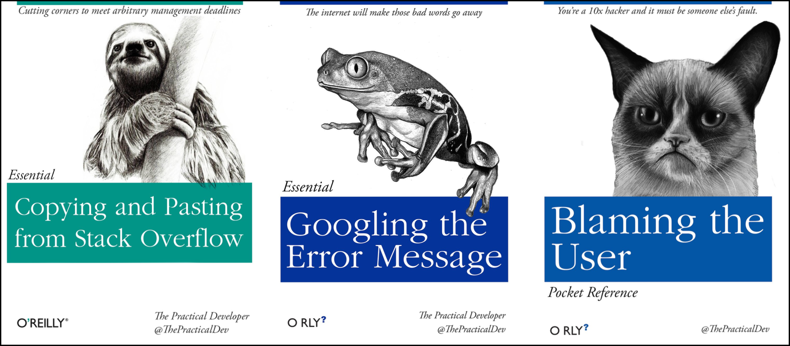

::::::::::::::::::::::::::::::::::::::: objectives

- Locate help for an R function using `?`, `??`, and `args()`
- Check the version of R
- Be able to ask effective questions when searching for help on forums or using web searches

::::::::::::::::::::::::::::::::::::::::::::::::::

:::::::::::::::::::::::::::::::::::::::: questions

- How do I get help using R and RStudio?

::::::::::::::::::::::::::::::::::::::::::::::::::

## Getting help with R



No matter how much experience you have with R, you will find yourself
needing help. There is no shame in researching how to do something in R, and
most people will find themselves looking up how to do the same things that
they "should know how to do" over and over again. Here are some tips to make
this process as helpful and efficient as possible.

> "Never memorize something that you can look up"
> \-- A. Einstein

## Finding help on Stackoverflow and Biostars

Two popular websites will be of great help with many R problems. For **general**
**R questions**, [Stack Overflow](https://stackoverflow.com/) is probably the most
popular online community for developers. If you start your question "How to do X
in R" results from Stack Overflow are usually near the top of the list. For
**bioinformatics specific questions**, [Biostars](https://www.biostars.org/) is
a popular online forum.

:::::::::::::::::::::::::::::::::::::::::  callout

## Tip: Asking for help using online forums:

- When searching for R help, look for [answers with the 'r' tag](https://stackoverflow.com/questions/tagged/r).
- Get an account; not required to view answers but to required to post
- Put in effort to check thoroughly before you post a question; folks get
  annoyed if you ask a very common question that has been answered multiple
  times
- Be careful. While forums are very helpful, you can't know for sure if the
  advice you are getting is correct
- See the [How to ask for R help](https://blog.revolutionanalytics.com/2014/01/how-to-ask-for-r-help.html)
  blog post for more useful tips

::::::::::::::::::::::::::::::::::::::::::::::::::

## Help people help you

Often, in order to duplicate the issue you are having, someone may need to see
the data you are working with or verify the versions of R or R packages you
are using. The following R functions will help with this:

You can **check the version of R** you are working with using the `sessionInfo()`
function. Actually, it is good to save this information as part of your notes
on any analysis you are doing. When you run the same script that has worked fine
a dozen times before, looking back at these notes will remind you that you
upgraded R and forget to check your script.

```
sessionInfo()
```

```
R version 3.2.3 (2015-12-10)
Platform: x86_64-pc-linux-gnu (64-bit)
Running under: Ubuntu 14.04.3 LTS

locale:
[1] LC_CTYPE=en_US.UTF-8       LC_NUMERIC=C               LC_TIME=en_US.UTF-8
[4] LC_COLLATE=en_US.UTF-8     LC_MONETARY=en_US.UTF-8    LC_MESSAGES=en_US.UTF-8
[7] LC_PAPER=en_US.UTF-8       LC_NAME=C                  LC_ADDRESS=C
[10] LC_TELEPHONE=C             LC_MEASUREMENT=en_US.UTF-8 LC_IDENTIFICATION=C

attached base packages:
[1] stats     graphics  grDevices utils     datasets  methods   base

loaded via a namespace (and not attached):
[1] tools_3.2.3     packrat_0.4.9-1
```

Many times, there may be some issues with your data and the way it is formatted.
In that case, you may want to share that data with someone else. However, you
may not need to share the whole dataset; looking at a subset of your 50,000 row,
10,000 column dataframe may be TMI (too much information)! You can take an
object you have in memory such as dataframe (if you don't know what this means
yet, we will get to it!) and save it to a file. In our example we will use the
`dput()` function on the `iris` dataframe which is an example dataset that is
installed in R:

```
dput(head(iris)) # iris is an example data.frame that comes with R
                 # the `head()` function just takes the first 6 lines of the iris dataset
```

This generates some output (below) which you will be better able to interpret
after covering the other R lessons. This info would be helpful in understanding
how the data is formatted and possibly revealing problematic issues.

```
structure(list(Sepal.Length = c(5.1, 4.9, 4.7, 4.6, 5, 5.4),
    Sepal.Width = c(3.5, 3, 3.2, 3.1, 3.6, 3.9), Petal.Length = c(1.4,
    1.4, 1.3, 1.5, 1.4, 1.7), Petal.Width = c(0.2, 0.2, 0.2,
    0.2, 0.2, 0.4), Species = structure(c(1L, 1L, 1L, 1L, 1L,
    1L), .Label = c("setosa", "versicolor", "virginica"), class = "factor")), .Names = c("Sepal.Length",
"Sepal.Width", "Petal.Length", "Petal.Width", "Species"), row.names = c(NA,
6L), class = "data.frame")
```

Alternatively, you can also save objects in R memory to a file by specifying
the name of the object, in this case the `iris` data frame, and passing a
filename to the `file=` argument.

```{r, eval=FALSE}
saveRDS(iris, file="iris.rds") # By convention, we use the .rds file extension
```

## Final FAQs on R

Finally, here are a few pieces of introductory R knowledge that are too good to
pass up. While we won't return to them in this course, we put them here because
they come up commonly:

**Do I need to click Run every time I want to run a script?**

- No. In fact, the most common shortcut key allows you to run a command (or
  any lines of the script that are highlighted):
  
  - Windows execution shortcut: <KBD>Ctrl</KBD>\+<KBD>Enter</KBD>
  - Mac execution shortcut: <KBD>Cmd(⌘)</KBD>\+<KBD>Enter</KBD>
  
  To see a complete list of shortcuts, click on the <KBD>Tools</KBD> menu and
  select <KBD>Keyboard Shortcuts Help</KBD>

**What's with the brackets in R console output?**

- R returns an index with your result. When your result contains multiple values,
  the number tells you what ordinal number begins the line, for example:

```{r}
1:101 # generates the sequence of numbers from 1 to 101
```

In the output above, `[81]` indicates that the first value on that line is the
81st item in your result

**Can I run my R script without RStudio?**

- Yes, remember - RStudio is running R. You get to use lots of the enhancements
  RStudio provides, but R works independent of RStudio. See [these tips](https://support.rstudio.com/hc/en-us/articles/218012917-How-to-run-R-scripts-from-the-command-line) for running your commands at the command line

**Where else can I learn about RStudio?**

- Check out the <KBD>Help</KBD> menu, especially "Cheatsheets" section

:::::::::::::::::::::::::::::::::::::::: keypoints

- R provides thousands of functions for analyzing data, and provides several way to get help
- Using R will mean searching for online help, and there are tips and resources on how to search effectively

::::::::::::::::::::::::::::::::::::::::::::::::::


